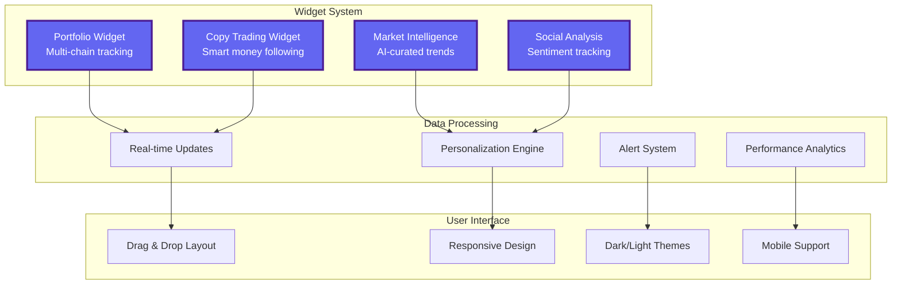
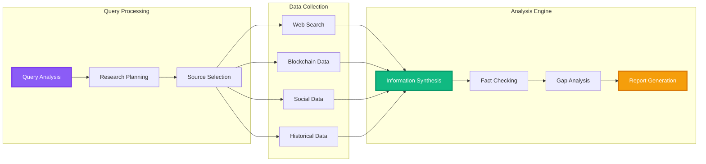
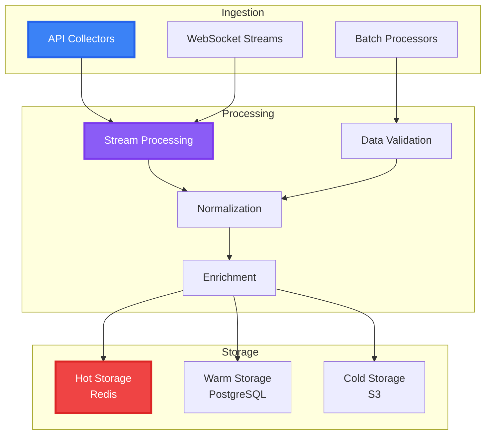

# Core Components Overview

Zonein's architecture consists of integrated AI systems working together to deliver real-time crypto intelligence. Each component leverages state-of-the-art technology to provide insights and recommendations based on comprehensive data analysis.

## AI-Powered Dashboard System

Our personalized dashboard adapts to each user's needs with intelligent widgets and real-time data streams.

### Dashboard Components

### Widget Features
- **Real-Time Data Streaming**: WebSocket connections for instant updates
- **Customizable Layout**: Drag-and-drop interface with saved preferences
- **Cross-Chain Support**: Unified view across 50+ blockchains
- **Intelligent Alerts**: AI-powered notifications for important events

## Browser Extension Architecture

Lightweight Chrome extension that brings AI intelligence to any crypto website.

### Extension Components
- **Content Script Engine**: Detects and analyzes page context
- **Background Service Worker**: Manages API calls and caching
- **Popup Interface**: Quick access to AI assistant
- **Storage Layer**: Secure local storage for session data

### Key Features
- **Context Detection**: Automatically understands current page
- **Session Memory**: Maintains conversation history
- **Instant Analysis**: Right-click functionality for quick insights
- **Privacy-First**: All processing happens securely

## Deep Research Engine

Advanced AI system that conducts institutional-grade research through multi-step reasoning.

### Research Pipeline

### Research Capabilities
- **Multi-Source Aggregation**: Combines data from 50+ trusted sources
- **Self-Reflective Analysis**: Iteratively improves research quality
- **Real-Time Updates**: Reports stay current with market changes
- **Citation Management**: Full transparency with source tracking

## Smart Money Analytics Engine

Sophisticated system for tracking and analyzing whale wallet behaviors.

### Analytics Components
- **Wallet Profiler**: Categorizes wallets by behavior and performance
- **Pattern Recognition**: Identifies trading strategies and trends
- **Performance Tracker**: Monitors P&L, win rate, and ROI
- **Copy Trading Engine**: Enables following successful strategies

### Advanced Features
- **Behavioral Analysis**: Understanding wallet intent and patterns
- **Network Mapping**: Visualizing connections between wallets
- **Predictive Modeling**: Forecasting future wallet actions
- **Risk Assessment**: Evaluating strategy safety

## 3D Network Visualization

Interactive WebGL-based system for exploring wallet relationships and money flows.

### Visualization Stack
- **Rendering Engine**: Three.js for high-performance 3D graphics
- **Graph Processing**: Force-directed layout algorithms
- **Interaction System**: Intuitive navigation and exploration
- **Data Pipeline**: Real-time updates of network changes

### Key Features
- **Interactive Exploration**: Zoom, pan, and rotate in 3D space
- **Wallet Clustering**: Visual grouping of related wallets
- **Money Flow Animation**: See transactions in real-time
- **Performance Filtering**: Focus on profitable wallets

## Telegram Bot Integration

AI-powered bot delivering personalized crypto intelligence directly to users' Telegram.

### Bot Features
- **Smart Notifications**: Real-time alerts for portfolio changes and opportunities
- **Conversational AI**: Natural language queries about tokens, wallets, and market trends
- **Personalized Recommendations**: AI-curated insights based on user preferences
- **Mobile-First Design**: Optimized for on-the-go crypto intelligence

### Integration Components
- **Webhook Architecture**: Instant message processing
- **Session Management**: Contextual conversations with memory
- **Notification Engine**: Intelligent alert filtering and timing
- **Security Layer**: Encrypted communications and user verification

## AI & Machine Learning Infrastructure

Core AI systems powering intelligent features across the platform.

### Model Architecture
- **Recommendation Models**: Collaborative filtering and deep learning
- **NLP Pipeline**: Natural language understanding for queries
- **Pattern Recognition**: Computer vision for chart analysis
- **Time Series Analysis**: Price prediction and trend detection

### Training Infrastructure
- **Data Pipeline**: Continuous model improvement with new data
- **A/B Testing**: Experimental framework for model evaluation
- **Model Versioning**: Rollback capability for safety
- **Performance Monitoring**: Real-time model accuracy tracking

## Data Processing Pipeline

High-performance infrastructure for real-time data analysis.

### Pipeline Components

### Performance Features
- **Sub-Second Latency**: Real-time processing for critical data
- **Horizontal Scaling**: Distributed processing across nodes
- **Data Validation**: Ensuring accuracy and consistency
- **Fault Tolerance**: Automatic recovery from failures

## Security & Privacy Layer

Enterprise-grade protection for all user data and operations.

### Security Features
- **End-to-End Encryption**: Secure data transmission
- **API Key Management**: Secure credential storage
- **Rate Limiting**: Protection against abuse
- **Privacy by Design**: Minimal data collection

### Compliance
- **Data Protection**: GDPR-compliant data handling
- **Audit Trails**: Complete activity logging
- **Access Control**: Role-based permissions
- **Regular Audits**: Security vulnerability testing

## Integration Framework

Seamless connections with external services and APIs.

### Supported Integrations
- **Blockchain APIs**: Moralis, Alchemy, QuickNode
- **Market Data**: CoinGecko, CoinMarketCap
- **Social Platforms**: Twitter, Reddit, Discord
- **Research Sources**: News aggregators, Tavily

### Integration Features
- **Unified API Gateway**: Single point of access
- **Rate Limit Management**: Intelligent request distribution
- **Fallback Mechanisms**: Automatic failover
- **Response Caching**: Improved performance

## Future Component Roadmap

### *Planned Enhancements*
- *Advanced LLM Integration*: Fine-tuned models for crypto
- *Smart Contract Capabilities*: Direct on-chain interactions
- *Decentralized Components*: Community-powered infrastructure
- *Multi-Agent Systems*: Collaborative AI decision-making

These core components work together seamlessly to deliver the Zonein experience, providing users with powerful tools for navigating the crypto market intelligently.