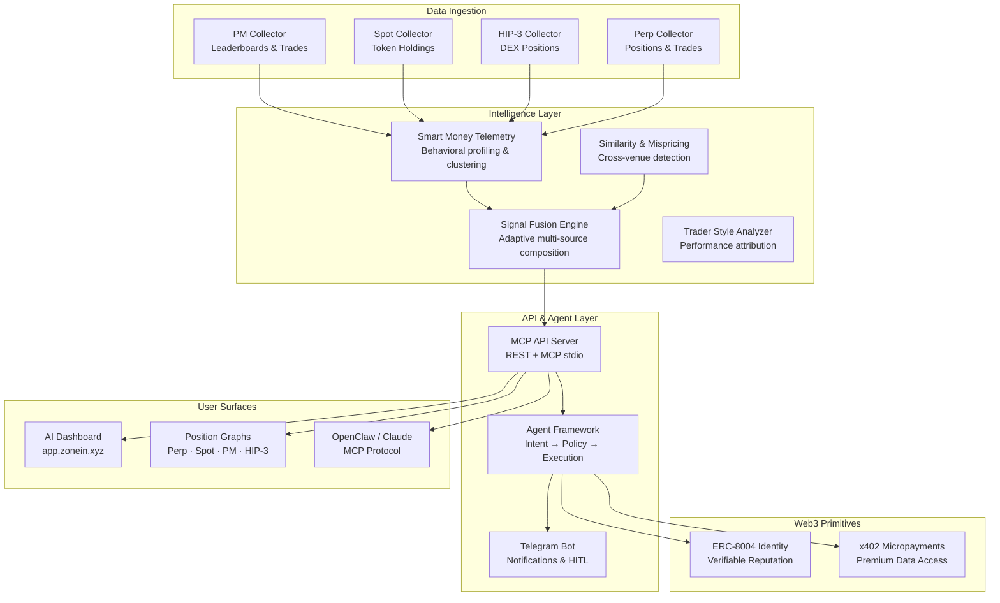
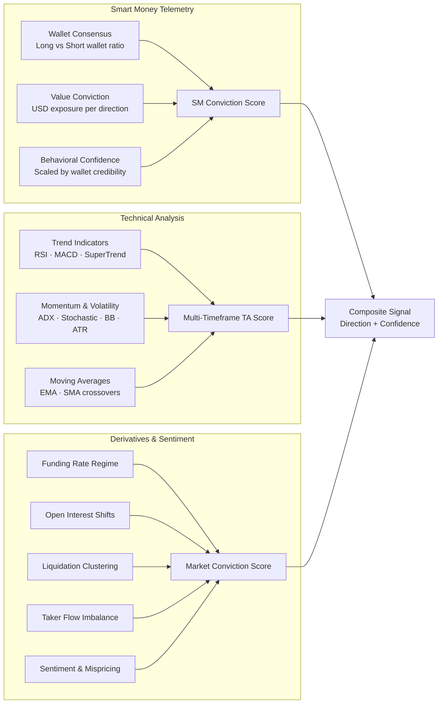
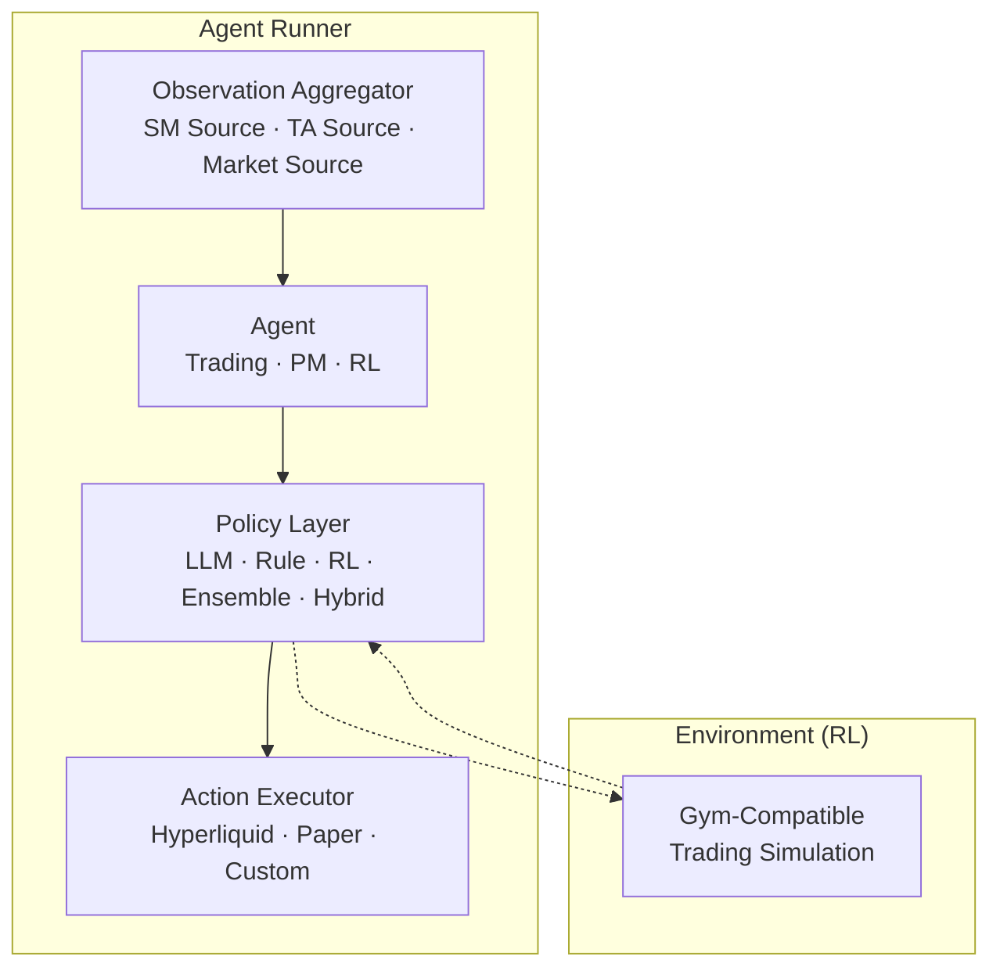

# How They Work Together

Zonein's core components form a vertically integrated stack: from raw on-chain data ingestion to composite signal processing to autonomous agent execution. User surfaces ([AI Dashboard](https://app.zonein.xyz), [Position Graphs](https://app.zonein.xyz/perp/), Telegram Bot) sit on a shared intelligence layer (Signal Fusion Engine, Smart Money Telemetry, Similarity & Mispricing Detection) and a common real-time data pipeline. On-chain orderbook data from Hyperliquid and Polymarket enters once through collectors, is validated and stored, then fused with technical analysis and derivatives flow into composite trading signals. Those signals power every surface consistently: a chart in the [dashboard](https://app.zonein.xyz), a graph node in the [Position Graph](https://app.zonein.xyz/perp/), a trade plan from an agent, and an API response to an external AI assistant all draw from the same truth.

```mermaid
graph TB
    subgraph "Data Ingestion"
        CF[PM Collector<br/>Leaderboards & Trades]
        SCF[Spot Collector<br/>Token Holdings]
        HF[HIP-3 Collector<br/>DEX Positions]
        PC[Perp Collector<br/>Positions & Trades]
    end

    subgraph "Intelligence Layer"
        SC[Signal Fusion Engine<br/>Adaptive multi-source composition]
        SME[Smart Money Telemetry<br/>Behavioral profiling & clustering]
        SE[Similarity & Mispricing<br/>Cross-venue detection]
        TSA[Trader Style Analyzer<br/>Performance attribution]
    end

    subgraph "API & Agent Layer"
        MCP[MCP API Server<br/>REST + MCP stdio]
        AF[Agent Framework<br/>Intent → Policy → Execution]
        TG[Telegram Bot<br/>Notifications & HITL]
    end

    subgraph "User Surfaces"
        DASH[AI Dashboard<br/>app.zonein.xyz]
        PG[Position Graphs<br/>Perp · Spot · PM · HIP-3]
        OC[OpenClaw / Claude<br/>MCP Protocol]
    end

    subgraph "Web3 Primitives"
        ERC[ERC-8004 Identity<br/>Verifiable Reputation]
        X402[x402 Micropayments<br/>Premium Data Access]
    end

    CF --> SME
    SCF --> SME
    HF --> SME
    PC --> SME
    SME --> SC
    SE --> SC
    SC --> MCP
    MCP --> DASH
    MCP --> PG
    MCP --> AF
    MCP --> OC
    AF --> TG
    AF --> ERC
    AF --> X402
```

# MCP API Server

The backbone of the platform. A FastAPI application running at `mcp.zonein.xyz` that serves as the unified gateway for all data access and agent management. It exposes seven route groups:

```mermaid
graph LR
    subgraph "MCP API Routes"
        D[/dashboard/*<br/>AI Signals · OHLC · SM Overlay<br/>Funding · Liquidation Map]
        P[/pm/*<br/>Leaderboard · Signals<br/>Traders · Similarity]
        PR[/perp/*<br/>Smart Traders · Signals<br/>Coins · Liquidation Map]
        DV[/derivatives/*<br/>OI · Funding · L/S Ratio<br/>Liquidation · Fear & Greed]
        T[/ta/*<br/>Multi-Timeframe Indicators<br/>Single & Bulk Queries]
        AG[/agents/*<br/>CRUD · Lifecycle · Vault<br/>Orders · Trade Plans]
        BT[/backtest/*<br/>Run · List · Dashboard]
    end
```

- **Agent routes**: Full CRUD lifecycle for trading agents, vault management (deposit/fund/withdraw), manual order placement, trade plan management (HITL), and performance statistics.
- **Backtest routes**: Run historical simulations against cached signals and real OHLC prices, list past backtests, and serve interactive dashboard pages with equity curves, trade markers, and daily PnL charts.

The server also runs an **MCP stdio protocol** for AI agent integration via OpenClaw and Claude Desktop — the same endpoints, exposed as structured tool calls.

# Signal Fusion Engine

The mathematical core of the platform. It ingests raw data from multiple independent sources and produces a single directional conviction score per asset — designed to surface opportunities where smart money behavior, technical structure, and derivatives flow all converge.

```mermaid
flowchart LR
    subgraph "Smart Money Telemetry"
        SM1[Wallet Consensus<br/>Long vs Short wallet ratio]
        SM2[Value Conviction<br/>USD exposure per direction]
        SM3[Behavioral Confidence<br/>Scaled by wallet credibility]
        SM1 --> SM_SCORE[SM Conviction Score]
        SM2 --> SM_SCORE
        SM3 --> SM_SCORE
    end

    subgraph "Technical Analysis"
        TA1[Trend Indicators<br/>RSI · MACD · SuperTrend]
        TA2[Momentum & Volatility<br/>ADX · Stochastic · BB · ATR]
        TA3[Moving Averages<br/>EMA · SMA crossovers]
        TA1 --> TA_AGG[Multi-Timeframe TA Score]
        TA2 --> TA_AGG
        TA3 --> TA_AGG
    end

    subgraph "Derivatives & Sentiment"
        MK1[Funding Rate Regime]
        MK2[Open Interest Shifts]
        MK3[Liquidation Clustering]
        MK4[Taker Flow Imbalance]
        MK5[Sentiment & Mispricing]
        MK1 --> MK_SCORE[Market Conviction Score]
        MK2 --> MK_SCORE
        MK3 --> MK_SCORE
        MK4 --> MK_SCORE
        MK5 --> MK_SCORE
    end

    SM_SCORE --> COMP[Composite Signal<br/>Direction + Confidence]
    TA_AGG --> COMP
    MK_SCORE --> COMP
```

Each source produces an independent conviction score. The fusion engine combines them with **adaptive weighting** — configurable per agent and per strategy, so a scalping agent can weight short-timeframe TA heavily while a whale-following agent emphasizes smart money consensus. Confidence increases when multiple independent sources converge on the same direction; it decreases when they diverge, signaling caution.

# Smart Money Telemetry

The backbone of ZoneIn's alpha generation. The smart money engine continuously profiles and tracks the highest-conviction wallets on Hyperliquid — a growing set of addresses selected by realized performance, not self-reported claims. Each wallet is characterized by realized PnL, win rate, hold duration, venue preference, leverage patterns, and behavioral fingerprints, then classified into behavioral clusters that expand as new trading patterns emerge.

For each tracked asset, the engine computes **multi-timeframe directional consensus**: how many wallets are long vs short, what USD volume is behind each direction, and how that consensus has shifted over time. When multiple high-credibility wallets align on the same direction — especially across timeframes — that's institutional-grade signal.

For full detail on behavioral profiling, credibility scoring, cluster detection, and per-asset-type signal depth, see [Smart Money Analytics](/capabilities/for-users/smart-money-tracking).

# Similarity Engines

Three dedicated engines compute position similarity between traders using cosine similarity over position vectors — PM (prediction market outcomes), Perp (perpetual futures direction), and Spot (token holdings). Each engine builds pairwise similarity graphs, runs community detection, and identifies consensus positions within each cluster.

These engines power the visual clustering in [Position Graphs](/capabilities/for-users/3d-network-graph) and the programmatic similarity queries in the [API](/capabilities/for-users/ai-assistant). For full detail, see [Smart Money Analytics — Similarity & Cluster Detection](/capabilities/for-users/smart-money-tracking#similarity--cluster-detection).

# Trader Style Analyzer

A comprehensive profiling system that characterizes trading behavior across multiple dimensions — risk profile, timing intelligence, market selection, performance decomposition, and automated style classification. Scoring uses a multi-factor formula that weighs realized ROI, win rate, profit factor, consistency, volume, trade frequency, and hold patterns — ensuring that high scores reflect sustained edge, not lucky streaks.

For the full breakdown of profiling dimensions, see [Smart Money Analytics — Behavioral Analysis](/capabilities/for-users/smart-money-tracking#behavioral-analysis--style-profiling).

# Agent Framework

A **domain-agnostic framework** for building autonomous agents that supports multiple paradigms:

```mermaid
graph TB
    subgraph "Agent Runner"
        OA[Observation Aggregator<br/>SM Source · TA Source · Market Source]
        OA --> AGENT[Agent<br/>Trading · PM · RL]
        AGENT --> POLICY[Policy Layer<br/>LLM · Rule · RL · Ensemble · Hybrid]
        POLICY --> EXEC[Action Executor<br/>Hyperliquid · Paper · Custom]
    end

    subgraph "Environment (RL)"
        ENV[Gym-Compatible<br/>Trading Simulation]
    end

    POLICY -.-> ENV
    ENV -.-> POLICY
```

- **Core Abstractions**: `BaseAgent`, `Observation` (universal input), `Action`, `Policy`, `Environment`, `AgentRunner`
- **Policy Types**: LLM, Rule, RL (reinforcement learning), Ensemble (weighted combination), and Hybrid (LLM + rule constraints)
- **LLM Integration**: OpenAI, Anthropic, DeepSeek, and custom providers
- **Storage**: MongoDB persistence for agent state, trade history, and configuration
- **Plugins**: Domain-specific extensions (trading plugin for Hyperliquid)
- **Continuous Learning**: Daily feedback loop analyzes every closed trade, detects recurring failure patterns, enriches LLM prompt context with past outcomes, and surfaces threshold-tuning recommendations — agents get smarter with every trade

For full detail on strategy presets, trigger conditions, vault management, HITL trade plans, backtesting, the daily learning cycle, and manual orders, see [Trading Agents](/capabilities/for-users/deep-research).

# Telegram Integration

The Telegram bot provides **trade notifications** (auto agents) and **HITL trade plan approval** (inline Approve/Reject/Detail buttons — zero delay, zero LLM cost). Setup requires only a bot token from @BotFather; the system auto-detects the user's chat ID on `/start`.

For the full setup flow, sequence diagram, and approval options, see [MCP API — Telegram Bot](/capabilities/for-users/ai-assistant#telegram-bot).

# Security & Trust

- **Non‑custodial**: Agent vaults are user‑controlled — the platform cannot access your funds
- **View‑only analysis**: Private keys are never requested; all data comes from public on‑chain sources
- **Financial safety**: All financial commands require explicit `--confirm` before execution
- **Encrypted transport**: HTTPS end to end; API key authentication on all protected endpoints

# Future Endgame

ZoneIn is building toward a future where on-chain intelligence and agentic execution are indistinguishable — where signal, intent, and action collapse into a single loop:

- **ERC-8004 & x402**: Verifiable on-chain agent reputation and pay-per-request micropayments for premium data — detailed in [MCP API — Web3 Trust & Payments](/capabilities/for-users/ai-assistant#web3-trust--payments-roadmap)
- **RL-Based & Hybrid Policies**: The framework already supports Gym-compatible environments and ensemble policies — future agents will learn from market feedback loops
- **Expanded Venue Coverage**: Beyond Hyperliquid and Polymarket to new on-chain venues as they capture volume
- **Strategy Marketplace**: A curated ecosystem where agent configurations can be shared, backtested, and deployed — with verifiable performance on-chain

Each addition must pass two tests: it compresses the trader's OODA loop, and it can be explained clearly.
