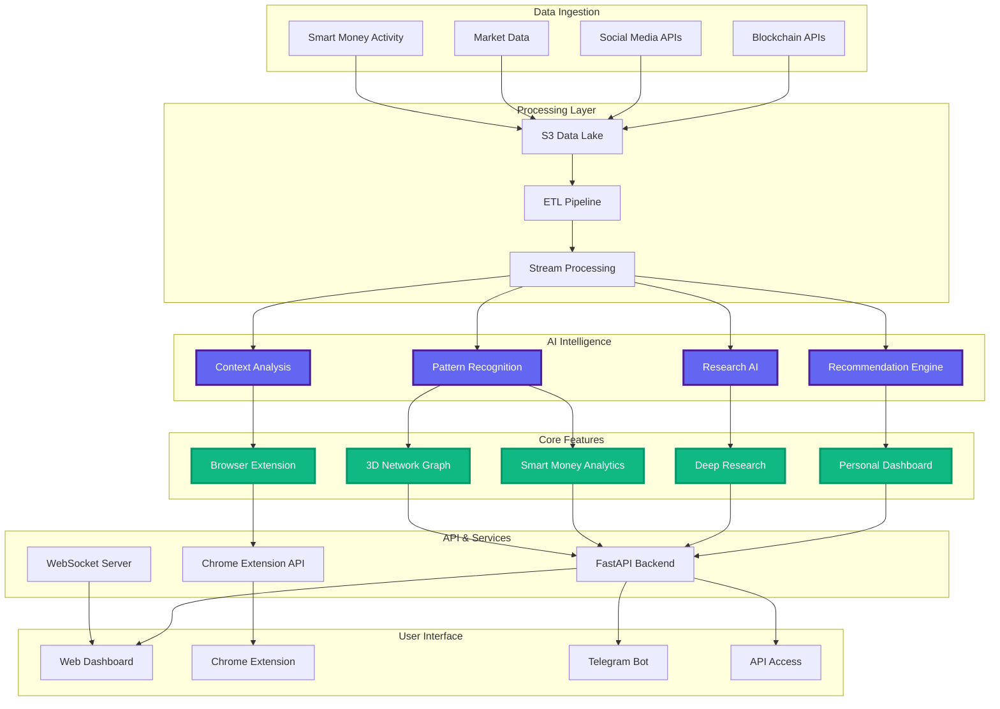
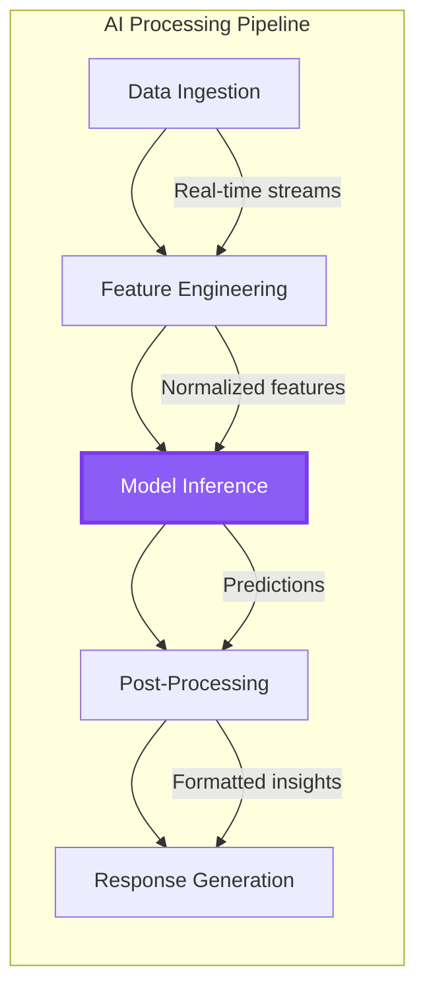
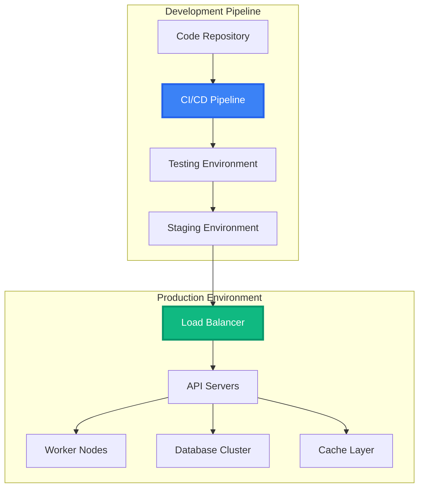

# Technical Architecture Overview

## System Design Philosophy

Zonein leverages cutting-edge AI infrastructure to process real-time blockchain and social data through sophisticated pipelines, enabling intelligent decision-making and personalized crypto insights at scale. Our cloud-native architecture seamlessly integrates multiple data sources to deliver actionable intelligence through an intuitive user experience.

## High-Level Architecture

## Architecture Layers

### Data Ingestion Layer
- **On-chain Data**: Real-time blockchain data from 50+ chains via APIs and indexing protocols
- **Social Intelligence**: Twitter, Reddit, Discord sentiment analysis and trend detection
- **Market Data**: Price feeds, volume, liquidity metrics from major exchanges
- **Smart Money Tracking**: Whale wallet monitoring and transaction pattern analysis

### AI Intelligence Layer
- **Recommendation Engine**: Personalized opportunity discovery using collaborative filtering and deep learning
- **Research AI**: Multi-step reasoning with self-reflection for institutional-grade analysis
- **Context Analysis**: Understanding user intent and current browsing context
- **Pattern Recognition**: Identifying trading patterns, wallet behaviors, and market trends
- **Real-time Processing**: Sub-second analysis and response generation

### Core Features Implementation
- **Personal Dashboard**: 
  - Customizable widget system with drag-and-drop interface
  - Real-time data streaming via WebSocket connections
  - Portfolio tracking across multiple chains
  - AI-powered market intelligence and alerts

- **Browser Extension**: 
  - Lightweight Chrome extension with context detection
  - Session memory for conversational interactions
  - Integration with any crypto website
  - Instant AI analysis overlay

- **Deep Research Engine**:
  - Multi-source data aggregation (50+ sources)
  - Iterative research workflow with gap analysis
  - Citation management and fact-checking
  - Real-time report updates

- **Smart Money Analytics**:
  - Wallet profiling and categorization
  - Trading pattern analysis and prediction
  - Copy trading functionality
  - Network effect analysis

- **3D Network Graph**:
  - WebGL-based visualization engine
  - Real-time wallet connection mapping
  - Interactive exploration with zoom/pan
  - Money flow animation and tracking

- **Telegram Bot**:
  - Real-time AI-powered notifications
  - Interactive chat interface for queries
  - Personalized alerts and recommendations
  - Mobile-first crypto intelligence

### API & Services Layer
- **FastAPI Framework**: High-performance async API architecture
- **WebSocket Server**: Real-time data streaming for dashboards
- **Chrome Extension API**: Secure communication between extension and backend
- **GraphQL Gateway**: Flexible data querying for complex relationships

### Security & Privacy
- **End-to-End Encryption**: Secure data transmission
- **Privacy-First Design**: No unnecessary data collection
- **API Key Management**: Secure credential storage
- **Rate Limiting**: Protection against abuse

## Key Technical Innovations

### AI-Powered Intelligence

### Real-Time Data Architecture
- **Stream Processing**: Apache Kafka/Kinesis for event streaming
- **In-Memory Caching**: Redis for low-latency data access
- **Time-Series Database**: Optimized storage for historical data
- **CDN Integration**: Global content delivery for static assets

### Scalability Features
- **Horizontal Scaling**: Microservices architecture with Kubernetes
- **Load Balancing**: Intelligent request routing
- **Auto-Scaling**: Dynamic resource allocation based on demand
- **Multi-Region Deployment**: Global availability and redundancy

## Performance Optimization

### Frontend Optimization
- **Code Splitting**: Lazy loading for faster initial load
- **Service Workers**: Offline capability and caching
- **WebAssembly**: High-performance computation in browser
- **Optimistic Updates**: Instant UI feedback

### Backend Optimization
- **Async Processing**: Non-blocking I/O operations
- **Query Optimization**: Efficient database queries with indexing
- **Batch Processing**: Aggregated operations for efficiency
- **Edge Computing**: Distributed processing closer to users

## Future Architecture Enhancements

### *Planned Capabilities*
- *Advanced LLM Integration*: Fine-tuned models for crypto-specific understanding
- *Smart Contract Interaction*: Direct on-chain execution capabilities
- *Decentralized Components*: Community-powered infrastructure
- *Multi-Agent Systems*: Autonomous agents for complex tasks

### *Scaling Roadmap*
- *Federated Learning*: Privacy-preserving model training
- *Blockchain Integration*: Native Web3 functionality
- *Cross-Chain Bridges*: Seamless multi-chain operations
- *AI Model Marketplace*: Community-contributed models

## Technical Stack

### Frontend
- **Framework**: Next.js with TypeScript
- **UI Library**: React with Tailwind CSS
- **State Management**: Redux Toolkit
- **Data Visualization**: D3.js, Three.js for 3D graphics

### Backend
- **API Framework**: FastAPI (Python)
- **Database**: PostgreSQL, Redis, TimescaleDB
- **Message Queue**: Apache Kafka
- **AI/ML**: PyTorch, Transformers, LangChain

### Infrastructure
- **Cloud Provider**: AWS with multi-region deployment
- **Container Orchestration**: Kubernetes with Helm
- **CI/CD**: GitHub Actions with automated testing
- **Monitoring**: Prometheus, Grafana, ELK stack

### Chrome Extension
- **Manifest V3**: Latest Chrome extension architecture
- **Background Service Worker**: Efficient resource usage
- **Content Scripts**: Seamless page integration
- **Secure Storage**: Encrypted local storage

## Integration Points

### External APIs
- **Blockchain Data**: Moralis, Alchemy, QuickNode
- **Market Data**: CoinGecko, CoinMarketCap
- **Social Data**: Twitter API, Reddit API
- **Research Sources**: Tavily, news aggregators

### Internal Services
- **Authentication Service**: JWT-based auth
- **Notification Service**: Real-time alerts
- **Analytics Service**: User behavior tracking
- **Recommendation Service**: Personalized content

## Deployment Architecture

This architecture ensures Zonein delivers fast, reliable, and intelligent crypto insights while maintaining the flexibility to scale and evolve with user needs. 