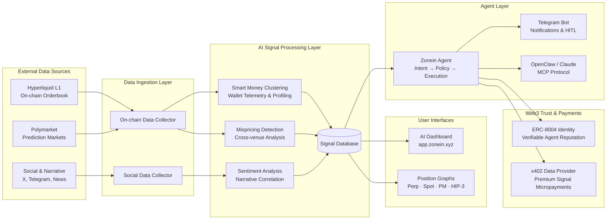
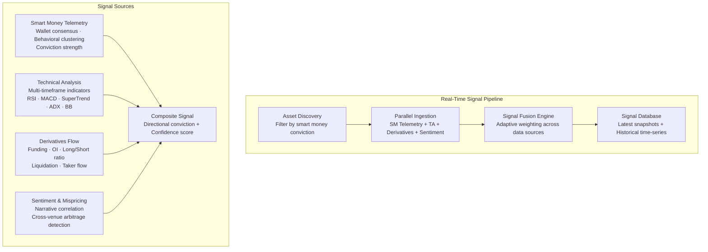
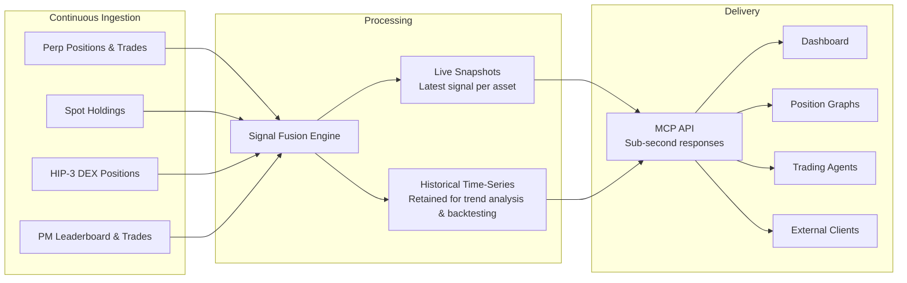

# Zonein Architecture

Zonein is a **superior intelligence layer and intent-centric agent launchpad** for on-chain traders. It continuously ingests orderbook activity, wallet behavior, derivatives flow, and market microstructure from Hyperliquid and Polymarket — fuses these streams with multi-timeframe technical analysis, sentiment correlation, and mispricing detection — then delivers real-time composite signals through an [AI Dashboard](https://app.zonein.xyz), interactive [Position Graphs](https://app.zonein.xyz/perp/), autonomous Trading Agents, and a public API that any bot or AI assistant can plug into. The architecture is designed for one thing: compressing the OODA loop from hours to milliseconds.

## System Overview

```mermaid
graph LR
    subgraph "External Data Sources"
        HL[Hyperliquid L1<br/>On-chain Orderbook]
        PM[Polymarket<br/>Prediction Markets]
        SOC[Social & Narrative<br/>X, Telegram, News]
    end

    subgraph "Data Ingestion Layer"
        OC[On-chain Data Collector]
        SC[Social Data Collector]
    end

    subgraph "AI Signal Processing Layer"
        SMC[Smart Money Clustering<br/>Wallet Telemetry & Profiling]
        MPD[Mispricing Detection<br/>Cross-venue Analysis]
        SENT[Sentiment Analysis<br/>Narrative Correlation]
        SDB[(Signal Database)]
    end

    subgraph "User Interfaces"
        DASH[AI Dashboard<br/>app.zonein.xyz]
        PG[Position Graphs<br/>Perp · Spot · PM · HIP-3]
    end

    subgraph "Agent Layer"
        AGENT[Zonein Agent<br/>Intent → Policy → Execution]
        TG[Telegram Bot<br/>Notifications & HITL]
        CLI[OpenClaw / Claude<br/>MCP Protocol]
    end

    subgraph "Web3 Trust & Payments"
        ERC[ERC-8004 Identity<br/>Verifiable Agent Reputation]
        X402[x402 Data Provider<br/>Premium Signal Micropayments]
    end

    HL --> OC
    PM --> OC
    SOC --> SC
    OC --> SMC
    OC --> MPD
    SC --> SENT
    SMC --> SDB
    MPD --> SDB
    SENT --> SDB
    SDB --> DASH
    SDB --> PG
    SDB --> AGENT
    AGENT --> TG
    AGENT --> CLI
    AGENT --> ERC
    AGENT --> X402
```

## From Data to Signal

The platform treats the market as a continuous stream of events across **four asset types**: [perpetual futures](https://app.zonein.xyz/perp/), [spot token holdings](https://app.zonein.xyz/spot), [HIP‑3 builder‑deployed perps](https://app.zonein.xyz/hip3), and [prediction markets](https://app.zonein.xyz/pm). Data arrives in real time from Hyperliquid's on-chain orderbook (positions, trades, funding, HIP‑3 DEXes) and Polymarket's API (leaderboards, positions, trades). Technical analysis indicators span multiple timeframes. Derivatives data provides open interest, funding rates, long/short ratios, and liquidation flows.

```mermaid
flowchart TB
    subgraph "Real-Time Signal Pipeline"
        DISCOVER[Asset Discovery<br/>Filter by smart money conviction] --> FETCH
        FETCH[Parallel Ingestion<br/>SM Telemetry + TA + Derivatives + Sentiment] --> CALC
        CALC[Signal Fusion Engine<br/>Adaptive weighting across data sources] --> STORE
        STORE[Signal Database<br/>Latest snapshots + Historical time-series]
    end

    subgraph "Signal Sources"
        SM[Smart Money Telemetry<br/>Wallet consensus · Behavioral clustering<br/>Conviction strength]
        TAScore[Technical Analysis<br/>Multi-timeframe indicators<br/>RSI · MACD · SuperTrend · ADX · BB]
        MKT[Derivatives Flow<br/>Funding · OI · Long/Short ratio<br/>Liquidation · Taker flow]
        SENT[Sentiment & Mispricing<br/>Narrative correlation<br/>Cross-venue arbitrage detection]
        SM --> COMPOSITE[Composite Signal<br/>Directional conviction + Confidence score]
        TAScore --> COMPOSITE
        MKT --> COMPOSITE
        SENT --> COMPOSITE
    end
```

Tokens must meet minimum smart money conviction thresholds before signals are computed — the system automatically filters for assets where enough high-credibility wallets have taken positions to produce a statistically meaningful consensus.

The signal fusion engine combines **smart money telemetry** (wallet-count ratio, value ratio, behavioral confidence), **multi-timeframe technical analysis** (RSI, MACD, SuperTrend, ADX, Bollinger Bands, and more across multiple timeframes), and **derivatives flow** (funding rate extremes, OI surges, liquidation clustering, taker flow imbalance) into a single directional conviction score. The weighting between sources is **adaptive** — configurable per agent and per strategy — and confidence increases when multiple independent sources converge on the same direction.

## What You Use

### [AI Dashboard](https://app.zonein.xyz)

Real-time command center. Assets ranked by composite conviction — click any asset for a full analysis page with OHLC charts, SM strength overlay, trade flow bubbles, funding rate, derivatives indicators, and liquidation heatmaps. See [AI Dashboard](/capabilities/for-users/ai-powered-dashboard) for the full detail page breakdown.

### [Position Graphs](https://app.zonein.xyz/perp/)

Four interactive bipartite graphs ([PM](https://app.zonein.xyz/pm), [Perp](https://app.zonein.xyz/perp/), [Spot](https://app.zonein.xyz/spot), [HIP-3](https://app.zonein.xyz/hip3)) render the live relationship between smart money wallets and their positions. Pre-computed server-side, rendered with D3.js. See [Position Graph](/capabilities/for-users/3d-network-graph).

### [MCP API](https://mcp.zonein.xyz/docs) & Telegram

REST API + MCP stdio server for programmatic access. Telegram bot for trade notifications and HITL approval. See [MCP API & Integrations](/capabilities/for-users/ai-assistant).

### Trading Agents

Autonomous agents that consume composite signals, apply custom strategy and trigger conditions, and execute on Hyperliquid via non-custodial vaults. Auto or HITL mode. See [Trading Agents](/capabilities/for-users/deep-research).

## Data Flow

```mermaid
flowchart LR
    subgraph "Continuous Ingestion"
        C1[Perp Positions & Trades]
        C2[Spot Holdings]
        C3[HIP-3 DEX Positions]
        C4[PM Leaderboard & Trades]
    end

    subgraph "Processing"
        C1 --> SIG[Signal Fusion Engine]
        C2 --> SIG
        C3 --> SIG
        C4 --> SIG
        SIG --> SNAP[Live Snapshots<br/>Latest signal per asset]
        SIG --> HIST[Historical Time-Series<br/>Retained for trend analysis & backtesting]
    end

    subgraph "Delivery"
        SNAP --> API[MCP API<br/>Sub-second responses]
        HIST --> API
        API --> DASH[Dashboard]
        API --> GRAPH[Position Graphs]
        API --> AGENT[Trading Agents]
        API --> EXT[External Clients]
    end
```

Data is ingested continuously from on-chain sources, processed into composite signals, and served through the MCP API. Live snapshots power real-time views; historical time-series enable trend analysis and backtesting. Responses are cached in-memory for sub-second latency.

## ZoneIn's Endgame

ZoneIn is building toward a future where signal, intent, and execution collapse into a single frictionless loop — verifiable agent reputation (ERC-8004), pay-per-request micropayments (x402), RL-based policies that learn from market feedback, expanded venue coverage, and a strategy marketplace with on-chain performance verification. For the full roadmap, see [Core Components — Future Endgame](/architecture/core-components#future-endgame) and [MCP API — Web3 Trust & Payments](/capabilities/for-users/ai-assistant#web3-trust--payments-roadmap).

Typical scenarios illustrate how this works in practice: browsing the [AI Dashboard](https://app.zonein.xyz) to find assets where smart money, TA, and derivatives flow all converge; opening a [Position Graph](https://app.zonein.xyz/perp/) to see which high-conviction wallets share positions in a token you're researching; deploying a HITL trading agent that proposes trades with full evidence for you to approve from Telegram; or querying your AI assistant with "What are whales doing on BTC?" and getting a composite answer in seconds.
