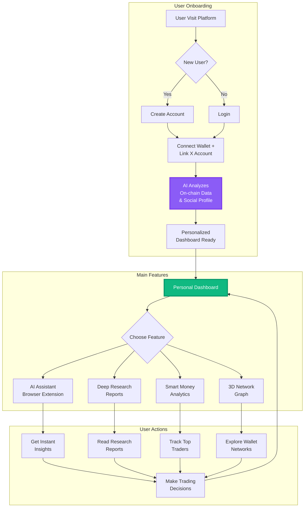
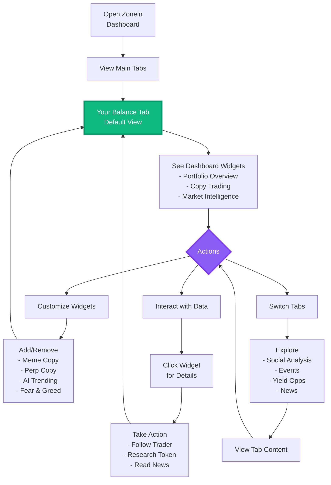
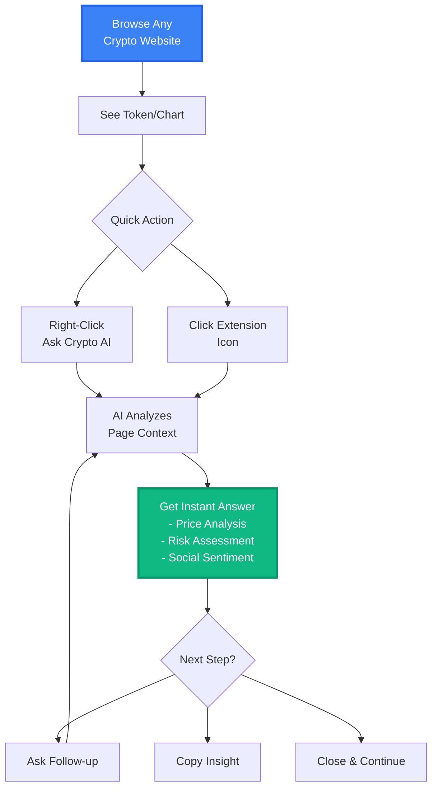
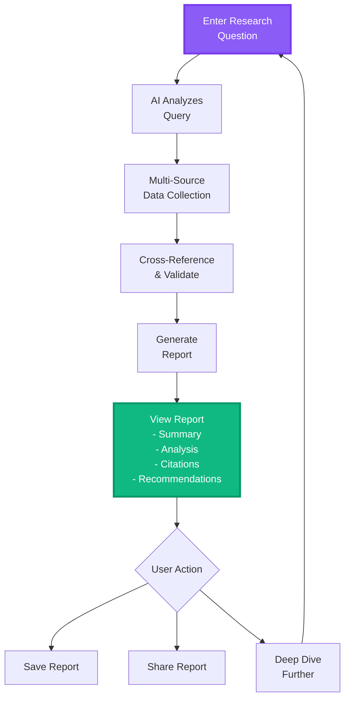
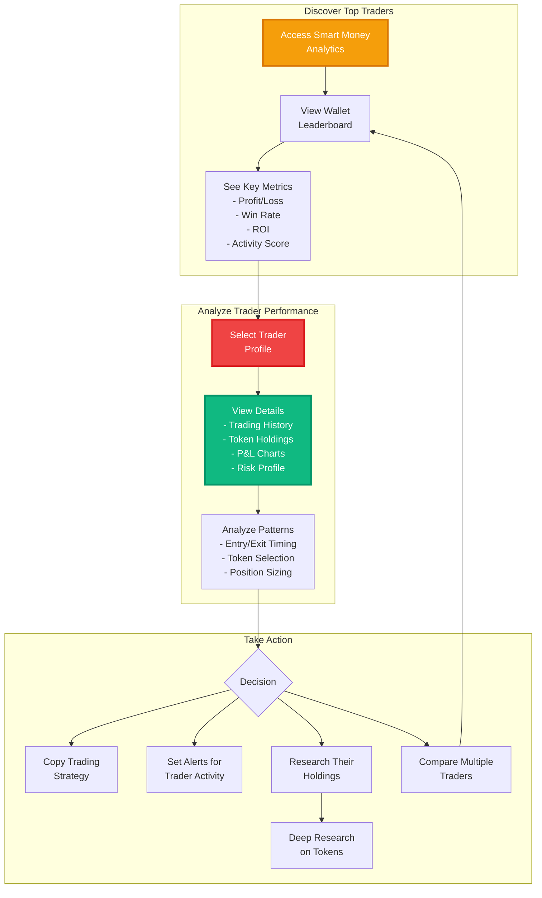
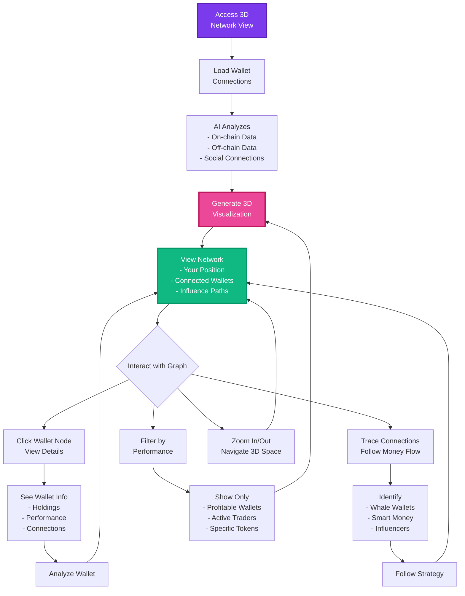

# User Flow Diagrams

Comprehensive user flow diagrams for the Zonein system, illustrating how users interact with our AI-powered features.

## 1. Overall User Flow

## 2. AI-Powered Dashboard User Flow

## 3. AI Assistant (Chrome Extension) User Flow

## 4. Deep Research Engine User Flow

## 5. Smart Money Analytics User Flow

## 6. Onchain 3D Network Graph User Flow

