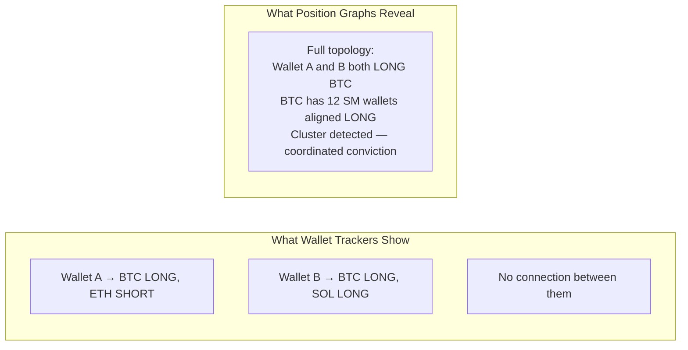

# Zonein Position Graph

You're researching a token. You check a wallet tracker — one address at a time, no context on whether the trader is any good. You check another. And another. After 30 minutes, you still don't know: _how many_ smart wallets are in this trade? _Which direction_ are they leaning? _Who else_ agrees with them?

The Position Graph answers all of that **in a single glance**. It renders the entire flow topology — every tracked smart money wallet connected to every position they hold — as an interactive graph you can zoom, filter, and drill into. Wallets on one side, assets on the other, connected by links that encode direction, size, leverage, and PnL.

When you see a cluster of high-win-rate wallets converging on the same token with aligned leverage — that's not noise. That's institutional-grade consensus delivered visually.

# The Problem With Wallet Trackers

Traditional wallet trackers are one-dimensional: one wallet → one list of positions. You have no way to see:

- How many high-conviction wallets are in the _same_ trade
- Whether they're on the same _side_ (all LONG? mixed? hedging?)
- Which wallets tend to move _together_ (coordinated conviction)
- How a specific token's SM exposure compares to _everything else_

The Position Graph collapses this complexity into a single visual. Four graph types cover every asset class ZoneIn tracks: [perpetual futures](https://app.zonein.xyz/perp/), [spot holdings](https://app.zonein.xyz/spot), [prediction markets](https://app.zonein.xyz/pm), and [HIP-3 DEX positions](https://app.zonein.xyz/hip3).

# Four Graphs, Four Edges

## [**Perpetual Futures**](https://app.zonein.xyz/perp/) — Directional Conviction With Leverage

The richest graph. Every SM wallet connected to every perp position — direction (LONG green / SHORT red), position size, leverage, entry price, unrealized PnL. Token nodes show aggregated long/short value and live funding rate.

**The edge:** See at a glance which coins have the strongest SM consensus. A token with 15 wallets all LONG at moderate leverage, while another has 3 wallets split — that's a massive conviction gap most traders never see. Filter by side, minimum size, or wallet limit to focus on what matters.

## [**Spot Holdings**](https://app.zonein.xyz/spot) — Accumulation Before the Move

SM wallets connected to their token holdings — USD value, PnL, accumulation patterns. Token nodes show total holding value, holder count, and a critical metric: **profit/loss holder ratio** (how many wallets are in profit vs underwater).

**The edge:** A token with many SM holders mostly in profit means they got in early — the smart money accumulated before the narrative broke. A token where most SM holders are underwater might be a trap. This context is invisible from price charts alone.

## [**Prediction Markets**](https://app.zonein.xyz/pm) — Where the Sharpest Minds Converge

Top-ranked Polymarket traders connected to their market positions — conviction size, YES/NO direction, consensus clusters. Similarity overlay groups traders who bet on the same outcomes in the same direction.

**The edge:** When a cluster of top-ranked traders with high win rates all concentrate on YES for a market — and the current price says 40% — that's a probabilistic gap between crowd odds and expert conviction. The graph makes this visible instantly.

## [**HIP-3 DEX**](https://app.zonein.xyz/hip3) — The Frontier Nobody Watches

SM positions on Hyperliquid's builder-deployed perpetual DEXes. Each token node uses `COIN (DEX)` format (e.g., `HYPE (HyperSwap)`) so you can compare the same coin across different venues.

**The edge:** HIP-3 DEXes attract sophisticated traders exploiting pricing inefficiencies between venues. Seeing which DEX pairs draw SM capital — and how they position vs the main Hyperliquid perps — gives you edge on assets most traders don't even know exist.

# How To Use This

**Find consensus.** Open the perp graph. Look for tokens where many high-score wallets cluster on the same side. A token with many wallets all LONG and zero SHORT is a strong consensus signal — cross-reference with the [AI Dashboard](https://app.zonein.xyz) composite score for confirmation.

**Detect accumulation early.** The spot graph shows which tokens SM wallets are quietly accumulating. Look for tokens with many holders, high total value, and most holders in profit — that's early-stage conviction before the crowd catches on.

**Cross-market conviction.** Compare the same coin across perp and spot graphs. SM is LONG on perp _and_ accumulating on spot? That's double conviction. SHORT on perp but accumulating spot? Could be hedging — a more nuanced signal.

**Discover hidden venues.** The HIP-3 graph surfaces opportunities on builder-deployed DEXes that most traders don't monitor. See where the sharpest capital flows before it appears on mainstream dashboards.

**Read cluster consensus.** The PM graph's similarity overlay groups traders who agree. If a high-score cluster is concentrated on YES for a market, that's coordinated conviction from people with verifiable track records — not speculation.

# Why This Is Different

Wallet trackers give you addresses. Position Graphs give you **topology** — the full structure of who's positioned where, how much, in what direction, and who else agrees. Every node shows credibility scores, behavioral categories, and performance metrics. Every link shows position details. Every cluster reveals coordinated conviction that no single-wallet tool can surface.

**Getting started.** Open any graph — [Perp](https://app.zonein.xyz/perp/), [Spot](https://app.zonein.xyz/spot), [PM](https://app.zonein.xyz/pm), [HIP-3](https://app.zonein.xyz/hip3) — and explore. Zoom in on clusters. Hover over wallets. Click tokens to see who's in. The intelligence is visual, immediate, and actionable.
