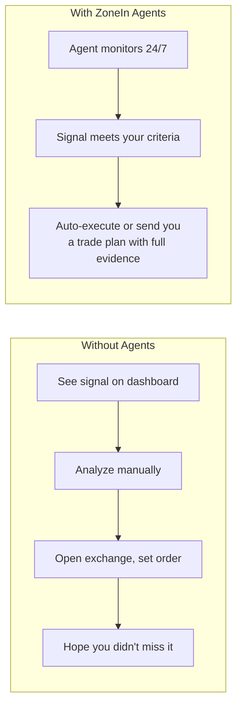
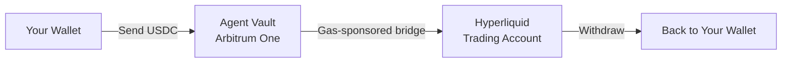
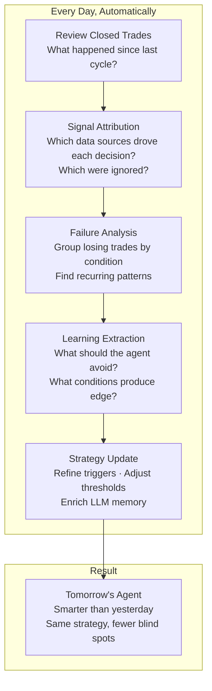

# Zonein Trading Agents

You found the signal. SM consensus is strong. TA confirms. Funding is neutral. But you're asleep, or at work, or three time zones away. By the time you see it, the entry is gone.

ZoneIn's Trading Agents close that gap. They consume the **same real-time composite signals** that power the [AI Dashboard](https://app.zonein.xyz) — smart money telemetry, technical analysis, derivatives flow — and act on them at machine speed. Describe your strategy, set your risk parameters, and the agent either executes automatically or proposes trade plans with full evidence for your approval.

No code required. Non-custodial vaults. Gas-sponsored bridging. Your keys, your funds, ZoneIn's intelligence — working 24/7.

# Why This Matters

The crypto market doesn't sleep. Opportunities emerge and vanish in minutes. The best setups — where SM consensus, TA structure, and derivatives flow all converge — are often the most time-sensitive. If you can't act instantly, you lose the edge.



Agents don't replace your judgment — they **extend it** to every minute of every day, with consistent discipline and zero emotional drift.

# Two Modes — You Choose the Control Level

**Auto Mode** — The agent executes trades immediately when your conditions are met. You get Telegram notifications after the fact. Best for validated strategies where you trust the edge and want zero latency.

**HITL Mode (Human-in-the-Loop)** — The agent builds a complete trade plan with full evidence — SM consensus, TA levels, derivatives context, LLM reasoning — and waits for your approval. Plans arrive via Telegram with inline **Approve / Reject / Detail** buttons. One tap to execute. Zero LLM cost, zero delay. Plans expire after 2 hours if not acted upon.

The difference: Auto mode captures every opportunity. HITL mode captures every opportunity _that you explicitly agree with_. Most traders start with HITL to build trust, then switch to Auto once they've validated the strategy.

# Strategy Presets — Start Trading in Minutes

ZoneIn provides tuned presets for different trading styles. Each preset comes with optimized timeframe weights, conviction thresholds, and risk parameters — but every parameter is fully customizable:

- **Scalping Pro** — Short-term entries, tight targets, emphasis on fast-moving signals. Quick in-and-out on high-liquidity assets
- **Momentum Hunter** — Rides momentum surges. Triggers on volume + OI spikes combined with SM consensus shifts
- **Swing Trader** — Multi-day holds based on longer-term SM conviction and trend-following TA. Higher conviction thresholds, wider stops
- **Whale Follower** — Prioritizes SM consensus above all other signals. Enters when the highest-credibility wallets converge
- **Stable Grower** — Conservative risk profile, strict drawdown limits. Requires strong multi-source convergence before entry
- **Precision Master** — High-conviction entries only. All signal sources must align strongly
- **Composite** — Balanced approach across all signal types. Good starting point

Presets are starting points. The real power is in **custom agents** — your own timeframe weights, trigger conditions, conviction thresholds per asset, and execution logic. The preset library expands as new strategies are validated.

# Custom Trigger Conditions — Your Rules, Your Edge

Define exactly when the agent should act. Triggers evaluate against raw signal data _before_ consulting the policy layer — so only the opportunities that match your specific thesis get through.

**Example:** "Go LONG when SM long_ratio is above 65%, at least 3 wallets agree, AND RSI on 4h isn't overbought":

```json
{
  "entry": {
    "long": {
      "op": "and",
      "conditions": [
        {"field": "sm.long_ratio", "compare": ">=", "value": 65},
        {"field": "sm.wallet_count", "compare": ">=", "value": 3},
        {"field": "ta.4h.rsi", "compare": "<=", "value": 65}
      ]
    }
  }
}
```

You can build conditions against **any signal field** — SM ratios, per-timeframe wallet counts, RSI, MACD, SuperTrend, ADX, Bollinger Bands, funding rate, OI change, liquidation volume, taker buy/sell ratio, and dozens more. Entry and exit conditions are independent, with AND/OR logic.

# The Policy Layer — From Signal to Decision

Once trigger conditions are met, the agent consults its policy:

- **LLM Policy** — An LLM receives the full signal data plus your strategy description and decides whether to trade, at what size, with what targets. The most flexible — it can reason about edge cases and market context
- **Rule Policy** — Pure threshold-based. No LLM, no cost, maximum speed and predictability
- **Hybrid Policy** — LLM picks direction and conviction, rules constrain leverage, size, and risk. Best of both worlds
- **Ensemble Policy** — Multiple policies vote. Only trades when enough agree — built-in caution
- **RL Policy** — Reinforcement learning agent (experimental). Learns from market feedback, not just rules

# HITL Trade Plans — Full Evidence, One-Tap Execution

In HITL mode, every trade plan arrives with everything you need to decide:

- **Signal**: Direction, symbol, entry price, stop loss, take profit
- **Thesis**: LLM reasoning explaining _why_ this trade makes sense now
- **Evidence**: SM consensus (score, wallet count, direction), TA levels (RSI, MACD, support/resistance), Market conditions (funding, OI, L/S ratio)
- **Risk assessment**: Portfolio equity, exposure after trade, max loss, position count

**Approval via Telegram** — Approve, Reject, Edit (modify entry/SL/TP/size), or Paper (simulate without risk). One tap. Instant execution. No LLM call on approval — zero cost, zero delay.

# Your Vault — Non-Custodial, Gas-Sponsored

Each agent gets its own vault. The platform **cannot access your funds** — ever.



**Deposit:** Send USDC to the vault's Arbitrum address → bridge to Hyperliquid (gas sponsored — no ETH needed) → agent starts trading.

**Withdraw:** Disable agent → withdraw to your wallet. Explicit `--confirm` required. Funds flow: Hyperliquid → Arbitrum → your address.

# Backtest Before You Risk Capital

Don't deploy blind. The backtest engine replays **real historical signals and OHLC prices** against your agent's configuration — trigger conditions, strength thresholds, timeframe weights — and shows you exactly what would have happened.

- **Equity curve** with starting → final balance
- **Trade markers** on the OHLC chart (entry/exit points)
- **Statistics**: Total return, Sharpe ratio, max drawdown, win rate, profit factor, average trade duration
- **Full trade log**: Every entry/exit with reasoning, size, and PnL

Backtest, iterate, validate. Then deploy with confidence.

# Agents That Get Smarter Every Day

Most trading bots repeat the same mistakes forever. ZoneIn agents **learn from every trade** — especially the losing ones. The system runs a daily improvement cycle that analyzes what went wrong, identifies the patterns behind failures, and adapts the agent's strategy so it doesn't repeat the same mistakes tomorrow.

This is the difference between a static bot and an evolving trading partner.

## The Daily Improvement Cycle



## How It Works — Concrete Example

Imagine your agent went LONG on ETH three times this week in similar conditions: SM consensus was strong, RSI was mid-range, but funding rate was extremely positive each time. All three trades lost — price dumped as over-leveraged longs got squeezed.

Here's what the learning cycle does:

1. **Attribution**: Tags all three trades with their signal state at entry — SM score, TA values, funding rate, OI, everything
2. **Pattern detection**: Identifies "LONG entry during extreme positive funding" as a recurring failure pattern across these trades
3. **LLM memory update**: Injects this into the agent's prompt context: _"Warning: In the past week, 3 LONG entries during extreme positive funding all resulted in losses averaging -X%. The funding environment was the common factor."_
4. **Threshold recommendation**: Surfaces a suggestion: _"Adding a funding rate filter (avoid LONG when funding exceeds a high threshold) would have avoided all three losses"_
5. **Next decision**: When a similar setup appears tomorrow — strong SM LONG, good RSI, but extreme funding — the LLM now has memory of the failure pattern. It can decide to skip the trade, reduce size, or wait for funding to normalize

The agent didn't just lose money. It **learned why** and adjusted.

## Five Layers of Continuous Improvement

**1. Trade-Level Attribution**

Every closed trade is analyzed against the full signal state at entry. Which sources contributed to the decision? Which were ignored? What was the outcome? This creates a per-agent **decision audit trail** — a structured record of every decision and its result that the LLM policy can reference in future decisions.

**2. Failure Pattern Detection**

The system groups losing trades by market condition and identifies recurring loss patterns:
- Losses during funding rate extremes (crowded trades getting squeezed)
- Poor entries during low-ADX regimes (choppy, trendless markets)
- Whipsaws in ranging conditions (false breakouts)
- Losses on specific assets (the agent may have edge on BTC but not on small-caps)
- Time-of-day patterns (low-liquidity periods with higher slippage)

These aren't generic warnings — they're specific to _your agent's_ actual trading history.

**3. LLM Prompt Context Enrichment**

For LLM-based policies, past trade outcomes and failure patterns are injected directly into the agent's prompt context. The LLM doesn't just see current signals — it sees:
- Recent trade results with outcomes
- Identified failure patterns with specific conditions
- Win/loss statistics per asset, per condition type
- The reasoning it used on past trades that failed

This gives the LLM **memory** — something most trading bots fundamentally lack. It's the difference between "here are today's signals, decide" and "here are today's signals, and here's what happened the last 5 times you saw similar conditions."

**4. Threshold Self-Tuning**

Backtesting results feed back as concrete recommendations:
- _"Tightening SM consensus threshold from 60 to 70 would have avoided the worst drawdown period"_
- _"Adding a minimum ADX filter would have prevented 4 of 7 losing trades in ranging markets"_
- _"Reducing position size when funding is extreme would have cut max loss by 40%"_

You decide whether to apply these — the system surfaces the insight, you keep control.

**5. Performance Degradation Alerts**

The system continuously monitors your agent's rolling performance metrics — Sharpe ratio, win rate, max drawdown, consecutive losses. When any metric deviates from historical norms, it flags the agent immediately. You can pause, review the failure analysis, apply recommended adjustments, and re-deploy — before losses compound.

## The Compounding Effect

Day 1: The agent trades with your initial strategy. Some wins, some losses.

Day 7: The agent has identified two failure patterns — it avoids those conditions now.

Day 30: The agent has a rich memory of what works and what doesn't in the specific market conditions it's experienced. Its LLM context includes dozens of past trade outcomes. Threshold recommendations have been validated by backtesting.

Day 90: The agent's strategy has been refined through hundreds of real trades. It's not the same agent you deployed on Day 1 — it's **adapted** to the market, to your risk profile, and to the specific conditions where your strategy has edge vs where it doesn't.

This is the endgame: agents that don't just follow rules, but evolve their own judgment based on lived experience. Every losing trade becomes tuition for the next one.

# Full Control — Manual Orders & Monitoring

Even with an active agent, you keep full manual control:

- **Open/close positions** directly through the agent's vault
- **Monitor performance** — PnL, ROI, win rate, Sharpe ratio, max drawdown, profit factor, trade history
- **Check balances** — vault balance on both Arbitrum and Hyperliquid

# Trust & Safety

**Non-custodial.** The platform cannot access your funds. Withdrawal requires explicit confirmation.

**Every financial command is gated.** Fund, open, close, withdraw, deploy, enable — the system refuses to execute unless you explicitly confirm. Never chains multiple financial commands.

**Full transparency.** Every trade decision is logged with signal data, trigger evaluation, and LLM reasoning. You can audit exactly why any trade was opened or closed.

**Configurable risk controls.** Max leverage, risk per trade, max daily loss, risk/reward ratio, minimum confidence, minimum consensus, withdrawal address whitelist.

# Why This Is Different

Most trading bots are black boxes that execute predefined rules. ZoneIn agents are **intent-driven**: you describe your strategy, the system compiles it into executable policy with risk guardrails. They consume the richest signal stack in crypto — the same SM telemetry, TA, and derivatives data that powers the dashboard — and they get smarter with every trade.

**Getting started.** Create an agent, pick a preset (or build custom), fund your vault with USDC, and let it trade. Start with HITL mode to build trust — approve trades from Telegram with one tap. Once you're confident, switch to Auto and let the agent work 24/7.
