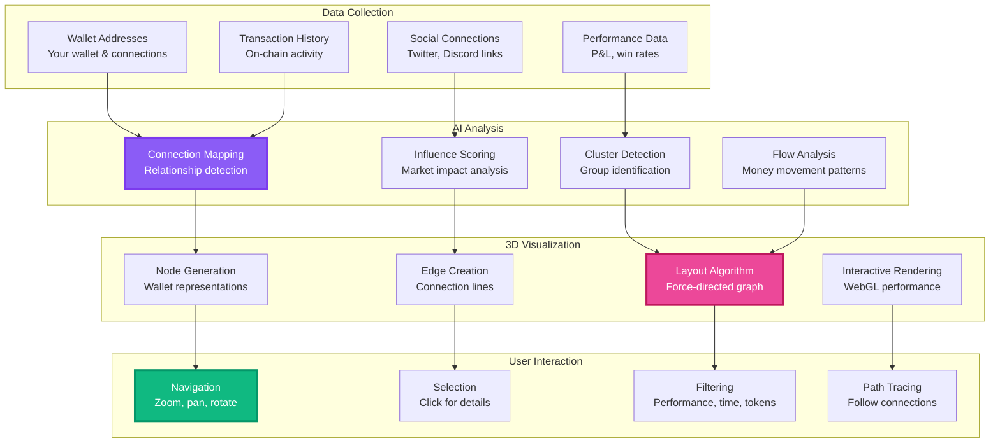

# Onchain 3D Network Graph

Visualize the hidden connections in crypto with our revolutionary 3D network visualization that reveals wallet relationships, money flows, and market influence patterns in an interactive, explorable environment.

## Overview

The 3D Network Graph transforms complex on-chain data into an intuitive visual experience, allowing you to explore wallet connections, track money movements, and identify key market players through an interactive 3D interface.

## How It Works

## Key Features

### Interactive 3D Exploration
- **360° Navigation**: Rotate, zoom, and pan through the network
- **Smooth Performance**: WebGL-powered rendering for fluid interaction
- **Dynamic Layout**: Force-directed algorithms create organic visualizations
- **Real-Time Updates**: See new connections as they form

### Wallet Node Information
Each wallet node displays:
- **Address & ENS**: Identity information
- **Performance Metrics**: P&L, win rate, ROI
- **Holdings Overview**: Major token positions
- **Activity Level**: Transaction frequency and volume
- **Influence Score**: Market impact rating

### Connection Analysis
Understand relationships between wallets:
- **Transaction Flows**: See money movement between wallets
- **Frequency Indicators**: Line thickness shows interaction frequency
- **Direction Arrows**: Visualize flow direction
- **Value Indicators**: Color coding for transaction sizes

### Advanced Filtering
Focus on what matters:
- **Performance Filters**: Show only profitable wallets
- **Time-Based Filters**: Recent activity vs historical
- **Token Filters**: Specific token transactions
- **Whale Filter**: Large holders only
- **Activity Filter**: Active traders vs holders

## Use Cases

### Whale Watching
- Track large wallet movements and accumulation patterns
- Identify wallet clusters controlled by single entities
- Monitor exchange flows and OTC movements
- Spot early accumulation before price moves

### Smart Money Analysis
- Follow successful trader networks
- Identify copy trading opportunities
- Understand trading group dynamics
- Discover new alpha sources

### Risk Assessment
- Identify concentration risks in tokens
- Spot potential rug pull patterns
- Monitor team wallet activities
- Track vesting wallet movements

### Market Research
- Understand token holder distribution
- Analyze community growth patterns
- Track adoption through wallet growth
- Identify key influencers and connectors

## Visual Elements

### Node Types
- **Your Wallet**: Highlighted in gold with pulsing effect
- **Whale Wallets**: Larger nodes sized by holdings
- **Smart Money**: Green nodes for profitable wallets
- **Exchange Wallets**: Blue nodes with exchange logos
- **Contract Addresses**: Purple nodes for smart contracts

### Connection Types
- **Direct Transfers**: Solid lines between wallets
- **Token Swaps**: Dashed lines for DEX interactions
- **Social Links**: Dotted lines for verified connections
- **Influence Paths**: Gradient lines showing impact direction

### Color Coding
- **Profitability**: Green (profit) to Red (loss) spectrum
- **Activity Level**: Brightness indicates recent activity
- **Risk Level**: Yellow to red for suspicious patterns
- **Relationship Strength**: Line opacity shows frequency

## Performance Optimization

### Rendering Technology
- **WebGL Engine**: Hardware-accelerated graphics
- **LOD System**: Level of detail for smooth zooming
- **Occlusion Culling**: Only render visible nodes
- **Progressive Loading**: Load details as needed

### Data Management
- **Smart Caching**: Preload likely navigation paths
- **Incremental Updates**: Add new data without full refresh
- **Compression**: Efficient data transfer
- **Pagination**: Handle millions of wallets smoothly

## Advanced Features

### Path Finding
- **Shortest Path**: Find connections between any two wallets
- **Money Trail**: Track funds through multiple hops
- **Influence Path**: See how trends spread through network
- **Time Travel**: View historical network states

### Analytics Integration
- **Cluster Analysis**: Automatic grouping of related wallets
- **Centrality Metrics**: Identify most influential nodes
- **Flow Analysis**: Understand money movement patterns
- **Anomaly Detection**: Highlight unusual activities

### Export & Sharing
- **Screenshot**: Capture current view as image
- **Video Recording**: Create network exploration videos
- **Data Export**: Download connection data as CSV
- **Share View**: Generate links to specific network views

## Getting Started

### Basic Navigation
1. **Search**: Enter any wallet address to center view
2. **Explore**: Click and drag to rotate the network
3. **Zoom**: Scroll to zoom in/out
4. **Select**: Click any node for detailed information

### Pro Tips
- Use filters to reduce visual clutter
- Follow the thickest lines to find major players
- Look for tight clusters to identify groups
- Watch for sudden connection changes as signals

## Technical Details

### Supported Chains
- Ethereum and all EVM chains
- Bitcoin (limited to address clustering)
- Solana, Cosmos, and other major chains
- Cross-chain connection mapping

### Data Sources
- On-chain transaction data
- Social media verifications
- Exchange KYC connections (anonymized)
- DeFi protocol interactions

### Update Frequency
- Real-time for active addresses
- 5-minute refresh for broader network
- Historical data available for 2+ years
- Configurable refresh rates

## Privacy & Security

- **No Private Keys**: View-only access to public data
- **Anonymous Mode**: Explore without connecting wallet
- **Local Rendering**: Graph processing happens in browser
- **Encrypted Connections**: Secure data transmission

The 3D Network Graph transforms blockchain data into actionable visual intelligence, helping you understand the hidden dynamics of the crypto market. 