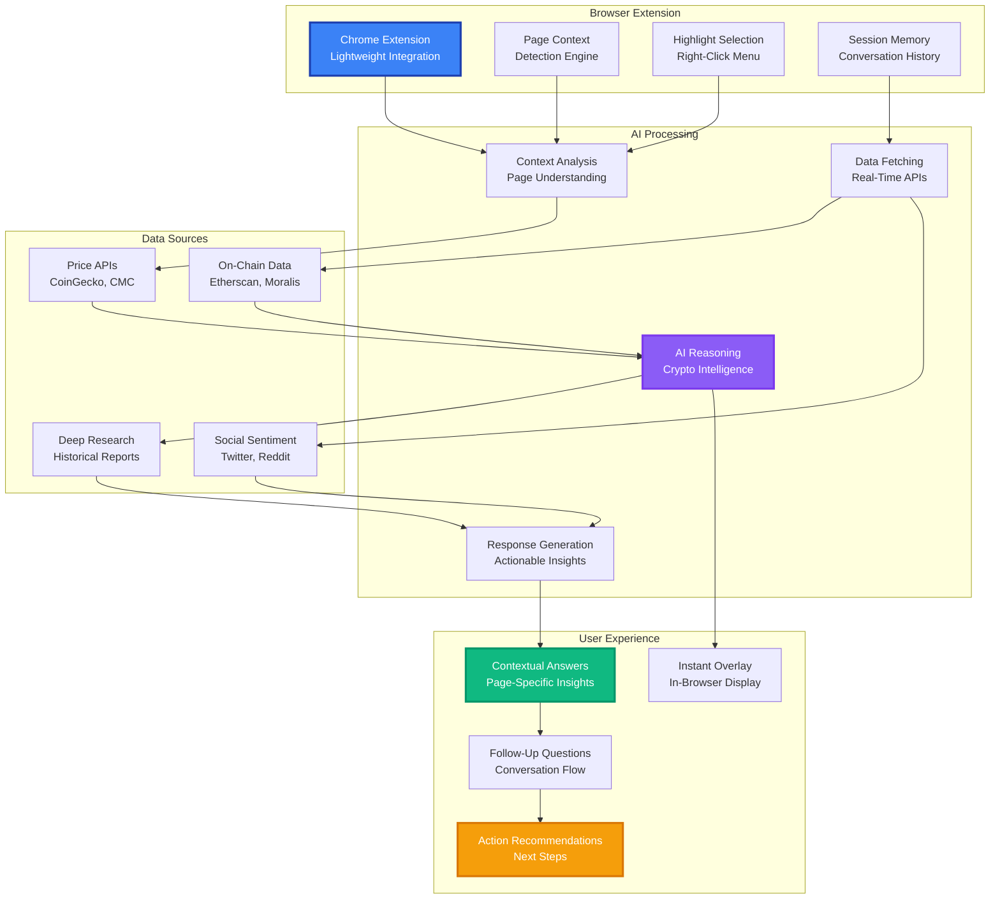

# AI-Powered Crypto Assistant

A lightweight Chrome extension that brings your Crypto AI Assistant to any webpage, so you can query and analyze on-chain & off-chain data in context, without leaving your browser.

## Core Features

### Context-Aware Q&A
- **Page Context Detection**: Automatically detects current page context including token symbols, chart views, and contract addresses
- **Session Memory**: Remembers prior questions within the same session for seamless follow-up conversations
- **Intelligent Understanding**: Knows exactly what you're looking at without manual input

### Data Integration
- **Real-Time Prices**: Fetches up-to-the-minute prices and market data
- **On-Chain Metrics**: Live data on holders, volume, liquidity, and transaction activity  
- **Social Sentiment**: Current community sentiment and social media trends
- **Historical Analysis**: Leverages deep research reports for historical comparisons and context

### Highlight-to-Ask
- **Universal Selection**: Select any text on any website and right-click to "Ask Crypto AI"
- **Instant Context**: Automatically sends your selection plus page URL as context to the AI
- **Cross-Platform**: Works on any crypto website - CoinGecko, Etherscan, DeFiLlama, and more
- **Smart Interpretation**: AI understands the context of what you've highlighted

### Actionable Insights
- **Concise Summaries**: Generates TL;DR insights like "Token XYZ unlocks 10% supply on June 30"
- **Trading Recommendations**: Specific next moves such as "Consider buying at $0.95 support"
- **Risk Alerts**: Warns about potential risks like "Monitor whale exits" or "High volatility expected"
- **Opportunity Detection**: Identifies potential opportunities based on current market conditions

## How It Works

## Revolutionary Browser Experience

### Seamless Website Integration

Transform any crypto website into an intelligent research platform:
- **Universal Compatibility**: Works on CoinGecko, Etherscan, DeFiLlama, Uniswap, and any crypto website
- **Zero Disruption**: Lightweight extension that doesn't interfere with normal browsing
- **Instant Activation**: Right-click or hotkey to activate AI analysis anywhere
- **Cross-Platform Data**: Combines information from multiple sources in real-time

### Intelligent Context Recognition

The AI that understands exactly what you're looking at:
- **Token Detection**: Automatically identifies token symbols, contract addresses, and market data
- **Chart Analysis**: Understands price charts, trading volumes, and technical indicators
- **Page Intelligence**: Recognizes DeFi protocols, yield farms, NFT collections, and more
- **Smart Formatting**: Presents information relevant to the current page context

### Instant Research & Analysis

Get professional-grade analysis without leaving your browser:
- **On-Demand Insights**: Click any token symbol to get instant analysis
- **Historical Context**: Compare current metrics to historical performance
- **Risk Assessment**: Immediate evaluation of potential investments
- **Market Intelligence**: Real-time sentiment and social media analysis

### Personalized Learning

The extension adapts to your interests and behavior:
- **Browsing Patterns**: Learns from the websites and tokens you research
- **Question History**: Remembers your research interests across sessions
- **Preference Adaptation**: Adjusts analysis depth based on your expertise level
- **Custom Alerts**: Proactive notifications about tokens you've researched

## Usage Examples

### Real-World Browser Scenarios

**On CoinGecko Token Page**
- Highlight token name → "What are the recent developments for this project?"
- Right-click price chart → "Analyze this price pattern and predict next move"
- Ask follow-up → "What's the social sentiment and whale activity?"

**On Etherscan Contract Page**
- Select contract address → "Explain what this smart contract does"
- Highlight transaction → "Is this transaction normal or suspicious?"
- Ask context → "What are the risks of interacting with this contract?"

**On DeFiLlama Protocol Page**
- Highlight TVL data → "How does this TVL compare historically?"
- Select yield percentage → "What are the risks of this yield farming opportunity?"
- Ask analysis → "Should I provide liquidity to this protocol?"

**On Uniswap Interface**
- Select token pair → "What's the impermanent loss risk for this pair?"
- Highlight swap rate → "Is this a good time to make this swap?"
- Ask strategy → "What's the optimal strategy for this token pair?"

### Smart Query Understanding

**Context-Aware Questions**
- "What's the current unlock schedule?" (automatically knows which token from page context)
- "How risky is this?" (understands what 'this' refers to from highlighted content)
- "Compare to competitors" (knows which project to compare based on current page)
- "Show recent whale activity" (automatically focuses on the relevant token/protocol)

**Follow-Up Intelligence**
- Session memory allows natural conversation flow
- "And what about the tokenomics?" continues previous analysis
- "How does that compare to last month?" references earlier metrics
- "What should I do next?" provides actionable recommendations based on discussion

### Browser-Native Intelligence

**Extension Performance**
- **Lightning Fast**: Sub-second response times for instant analysis
- **Offline Capability**: Cached data for basic analysis without internet
- **Low Resource Usage**: Minimal impact on browser performance
- **Privacy First**: Your browsing data stays private and secure

**Cross-Website Integration**
- **Universal Context**: Works seamlessly across all crypto websites
- **Data Aggregation**: Combines information from multiple sources in real-time
- **Smart Bookmarking**: Remembers important pages and tokens you've researched
- **Persistent Conversations**: Continue discussions across different websites

**Intelligent Notifications**
- **Page Alerts**: Get notified when visiting pages about tokens you're tracking
- **Market Updates**: Receive updates about tokens you've previously researched
- **Risk Warnings**: Immediate alerts about potential scams or high-risk investments
- **Opportunity Highlights**: Notifications about favorable conditions for tokens you follow

## Benefits

### For Active Researchers
- **Instant Analysis**: Get professional-grade insights on any crypto website
- **Time Savings**: No need to switch between multiple tabs and tools
- **Context Preservation**: Maintain research flow without losing track
- **Enhanced Due Diligence**: Comprehensive analysis at the point of research

### For DeFi Users
- **Risk Assessment**: Instant evaluation of protocols and opportunities
- **Smart Contract Analysis**: Understand what contracts do before interacting
- **Yield Strategy Guidance**: Expert advice on farming and liquidity provision
- **Security Warnings**: Immediate alerts about potential risks and scams

### For Portfolio Managers
- **Research Efficiency**: Streamlined analysis workflow across all platforms
- **Multi-Source Intelligence**: Aggregate data from various crypto websites
- **Historical Context**: Compare current metrics to historical performance
- **Decision Support**: Get recommendations based on comprehensive analysis

### For Crypto Beginners
- **Educational Companion**: Learn while browsing with contextual explanations
- **Risk Protection**: Warnings about high-risk investments and potential scams
- **Simplified Analysis**: Complex concepts explained in accessible language
- **Guided Learning**: Progressive education based on your browsing behavior

### For Professional Analysts
- **Research Acceleration**: Speed up analysis with AI-powered insights
- **Quality Control**: Verify findings with comprehensive data cross-referencing
- **Competitive Intelligence**: Analyze projects and protocols efficiently
- **Report Enhancement**: Enrich analysis with real-time data and context

## Technology Stack

### Browser Extension Architecture
- **Manifest V3**: Latest Chrome extension standard for security and performance
- **Content Scripts**: Seamless integration with any webpage without disruption
- **Background Service**: Efficient processing and API management
- **Popup Interface**: Clean, intuitive user interface for complex interactions

### AI & Data Processing
- **Crypto-Specialized LLMs**: Models trained specifically on blockchain and DeFi data
- **Context Analysis Engine**: Understands webpage content and user intent
- **Real-Time APIs**: Live integration with price feeds, on-chain data, and social metrics
- **Intelligent Caching**: Smart data caching for offline analysis capabilities

### Data Sources & Integration
- **Multi-Chain APIs**: Ethereum, BSC, Polygon, Arbitrum, and 20+ other blockchains
- **Market Data Feeds**: CoinGecko, CoinMarketCap, and real-time exchange APIs
- **Social Intelligence**: Twitter, Reddit, Discord sentiment and trend analysis
- **DeFi Protocols**: Direct integration with Uniswap, Aave, Compound, and major DeFi platforms

### Security & Privacy
- **Local-First Processing**: Sensitive analysis performed locally when possible
- **Zero Data Collection**: Your browsing history and queries remain private
- **Secure API Communications**: Encrypted connections to data sources
- **Permission Management**: Granular control over extension capabilities

### Performance Optimization
- **Lazy Loading**: Load AI models and data only when needed
- **Edge Caching**: Strategic caching for instant responses
- **Bandwidth Optimization**: Efficient data usage for mobile and limited connections
- **Resource Management**: Minimal impact on browser performance and battery life

## Use Cases

### Research & Due Diligence
- **Token Analysis**: Instant insights on any token page across crypto websites
- **Smart Contract Review**: Understand contract functionality before interaction
- **Project Evaluation**: Comprehensive analysis of crypto projects and protocols
- **Competitive Research**: Compare projects and identify market opportunities

### Risk Management
- **Scam Detection**: Immediate warnings about potential rug pulls and scams
- **Security Assessment**: Evaluate smart contract and protocol safety
- **Investment Risk**: Understand volatility and potential downside risks
- **Portfolio Protection**: Get alerts about risks in your tracked investments

### Educational Support
- **Concept Explanation**: Learn complex DeFi and blockchain concepts in context
- **Real-Time Learning**: Understand market events as they happen
- **Progressive Education**: Build knowledge through guided browsing experience
- **Technical Clarification**: Simplify complex technical documentation

### Market Intelligence
- **Sentiment Analysis**: Understand community perception and social trends
- **Whale Tracking**: Monitor large wallet movements and institutional activity
- **Price Analysis**: Technical analysis and prediction insights
- **Opportunity Discovery**: Identify emerging trends and investment opportunities

### DeFi Navigation
- **Protocol Guidance**: Expert advice on DeFi protocol usage and risks
- **Yield Strategy**: Optimize yield farming and liquidity provision strategies
- **Cross-Chain Analysis**: Understand multi-chain opportunities and risks
- **Gas Optimization**: Get advice on transaction timing and fee management

## Installation & Setup

### Easy Installation
1. **Chrome Web Store**: Download from official Chrome Web Store
2. **One-Click Install**: No configuration required for basic features
3. **Account Sync**: Optional account creation for personalized features
4. **Privacy Settings**: Configure data sharing and privacy preferences

### Getting Started
1. **Browse Normally**: Visit any crypto website as usual
2. **Highlight & Ask**: Select text and right-click "Ask Crypto AI"
3. **Contextual Analysis**: AI understands your page context automatically
4. **Follow-Up Questions**: Continue conversation for deeper insights

### Premium Features
- **Advanced Analytics**: Deeper analysis and historical comparisons
- **Portfolio Tracking**: Remember and track your research interests
- **Custom Alerts**: Personalized notifications and risk warnings
- **Priority Support**: Faster response times and enhanced features

## Competitive Advantages

### vs. Traditional Crypto Research
**Manual Research Process:**
- **Tab Switching**: Constantly switching between different crypto websites
- **Information Overload**: Struggling to synthesize data from multiple sources
- **Context Loss**: Losing track of research flow when moving between platforms
- **Time Intensive**: Hours spent gathering and analyzing information manually

**Zonein's Seamless Integration:**
- **Single Interface**: Access AI analysis on any crypto website without leaving
- **Contextual Intelligence**: AI understands exactly what you're researching
- **Instant Synthesis**: Immediate analysis combining multiple data sources
- **Research Flow**: Maintain focus and momentum throughout your analysis

### vs. Crypto AI Chatbots
**Generic AI Tools (ChatGPT, Claude):**
- **No Context**: Must manually explain what you're researching each time
- **Outdated Data**: Knowledge cutoff prevents access to current market information
- **Generic Responses**: Broad answers without crypto-specific expertise
- **Separate Interface**: Must leave your research to ask questions

**Zonein's Context-Aware AI:**
- **Automatic Context**: Instantly understands your current page and research focus
- **Live Data**: Real-time access to current prices, metrics, and market conditions
- **Crypto-Native**: Purpose-built for blockchain, DeFi, and cryptocurrency analysis
- **Integrated Experience**: Research and AI analysis in the same interface

### vs. Browser Bookmarks & Tools
**Traditional Research Tools:**
- **Static Bookmarks**: Passive storage without intelligent analysis
- **Manual Organization**: Time-consuming bookmark management and categorization
- **No Intelligence**: Raw data without insights or recommendations
- **Fragmented Workflow**: Different tools for different types of analysis

**Zonein's Intelligent Browsing:**
- **Smart Memory**: AI remembers your research interests and provides relevant updates
- **Automatic Organization**: Intelligent categorization of your research topics
- **Active Intelligence**: Proactive insights and risk warnings based on your browsing
- **Unified Workflow**: All analysis tools integrated into your natural browsing experience

### vs. Crypto Browser Extensions
**Basic Extensions (MetaMask, DeFi Pulse, Zapper):**
- **Limited Functionality**: Focus on single use cases like wallet management or price display
- **No AI Analysis**: Simple data display without intelligent insights
- **Manual Interpretation**: Users must analyze and interpret data themselves
- **Narrow Focus**: Specialized for specific tasks rather than comprehensive research

**Zonein's Comprehensive Intelligence:**
- **Universal Analysis**: Works on any crypto website with full AI capabilities
- **Intelligent Insights**: Advanced AI analysis and recommendations for all scenarios
- **Automated Research**: AI conducts analysis automatically based on your interests
- **Broad Expertise**: Covers trading, DeFi, security, research, and education

## Unique Value Propositions

### Technical Innovation
- **Context-Aware AI**: First extension to truly understand what you're researching
- **Real-Time Integration**: Live data from 50+ sources combined with AI analysis
- **Privacy-First Design**: Local processing with zero data collection
- **Universal Compatibility**: Works on every crypto website without modification

### User Experience Revolution
- **Zero Learning Curve**: Natural interaction through highlighting and right-clicking
- **Seamless Integration**: No disruption to your normal browsing habits
- **Instant Intelligence**: Get expert-level analysis without leaving your research flow
- **Personalized Learning**: Adapts to your interests and expertise level

### Crypto Market Specialization
- **DeFi Expertise**: Deep understanding of protocols, risks, and opportunities
- **Security Focus**: Immediate warnings about scams, rug pulls, and high-risk investments
- **Multi-Chain Intelligence**: Unified analysis across all major blockchains
- **Market Intelligence**: Real-time sentiment, whale tracking, and trend analysis

Transform your crypto research experience - where every website becomes an intelligent research platform, and complex analysis is just a right-click away. Experience the future of crypto browsing today. 