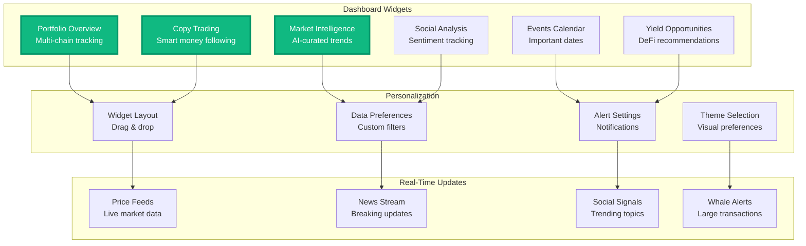
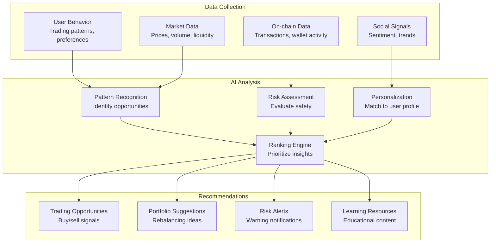

# AI-Powered Personal Dashboard

Zonein's intelligent dashboard is your command center for crypto - featuring customizable widgets, real-time market intelligence, and AI-powered recommendations that help you discover opportunities and make smarter decisions.

## Dashboard Overview

Your personalized crypto command center with intelligent widgets that adapt to your needs and trading style.

### Core Dashboard Features

## How the Recommendation Engine Works

The dashboard's AI-powered recommendation system analyzes multiple data sources to deliver personalized insights:

## Dashboard Widgets

### Portfolio Overview Widget
Your complete multi-chain portfolio in one view:
- **Real-Time Balances**: Track holdings across 50+ blockchains
- **Performance Metrics**: P&L, ROI, and historical charts
- **Asset Allocation**: Visual breakdown by chain, token, and sector
- **Quick Actions**: Buy, sell, or swap directly from the widget

### Copy Trading Widget
Follow the smartest traders automatically:
- **Top Trader Leaderboard**: See best performers by profit and win rate
- **Strategy Analysis**: Understand what successful traders are doing
- **One-Click Following**: Start copying strategies instantly
- **Risk Controls**: Set maximum allocation and stop-loss limits

### Market Intelligence Widget
AI-curated market insights and trends:
- **Trending Tokens**: What's gaining momentum right now
- **AI Predictions**: Price movement forecasts and confidence scores
- **News Summary**: Important updates affecting your portfolio
- **Opportunity Alerts**: High-potential trades identified by AI

### Social Analysis Widget
Real-time sentiment from crypto communities:
- **Twitter Trends**: What crypto Twitter is talking about
- **Reddit Sentiment**: Community mood on specific tokens
- **Discord Activity**: Developer and community engagement levels
- **Influencer Tracking**: Key opinion leader positions

### Events Calendar Widget
Never miss important crypto dates:
- **Token Unlocks**: Vesting schedules that could impact price
- **Protocol Updates**: Major upgrades and hard forks
- **Earnings/Reports**: DeFi protocol revenue announcements
- **Community Events**: AMAs, conferences, and launches

### Yield Opportunities Widget
DeFi yield farming recommendations:
- **APY Rankings**: Highest yields across protocols
- **Risk Ratings**: Safety scores for each opportunity
- **Impermanent Loss**: Calculator and warnings
- **Auto-Compound**: Set and forget yield strategies

## Personalization Features

### Graph-Based Intelligence Engine
Our recommendation system uses advanced graph algorithms to understand relationships:
- **Network Analysis**: Maps connections between users, wallets, and opportunities
- **Similarity Computation**: Uses cosine similarity and behavioral correlation
- **Multi-Hop Discovery**: Finds indirect relationships and hidden patterns
- **Real-Time Updates**: Continuously adapts to new data and behaviors

### Intelligent Similarity Framework
Three core similarity types power our recommendations:
- **User-User**: Find traders with similar strategies and success patterns
- **User-Content**: Match your profile to relevant opportunities
- **Content-Content**: Discover related investments and diversification options
- **Hybrid Approach**: Combines multiple similarity signals for accuracy

### Data-Driven Personalization
Every recommendation is tailored to your unique profile:
- **Behavioral Learning**: Adapts to your trading patterns and preferences
- **Risk Profiling**: Adjusts recommendations to your risk tolerance
- **Performance Tracking**: Learns from your successes and failures
- **Contextual Awareness**: Considers market conditions and timing

### Multi-Factor Intelligence Sources
Our graph engine processes diverse data streams for comprehensive insights:
- **Blockchain Analytics**: Direct smart contract analysis and transaction patterns
- **Market Intelligence**: Price movements, volume trends, and liquidity metrics
- **Social Signals**: Community sentiment and influencer activity tracking
- **Smart Money Flow**: Whale wallet movements and institutional patterns
- **Cross-Chain Data**: Unified view across all major blockchains

## Graph-Based Recommendation Engine

### Intelligent Similarity Framework

At the heart of our recommendation system lies a sophisticated graph-based approach that measures similarity between users, content, and opportunities. Every recommendation relies on finding entities that are "close" in behavior, interests, or characteristics.

### Similarity Analysis Types

**User-User Similarity:**
- Identifies wallets with similar trading patterns and portfolio compositions
- Analyzes shared DeFi activities, mutual follows, and risk patterns
- Uses cosine similarity and behavioral correlation metrics
- Output: "Wallets similar to you" recommendations

**User-Content Similarity:**
- Matches your profile to relevant opportunities and research
- Compares token holdings, risk appetite, and yield preferences
- Weighted scoring prioritizes important features
- Output: Personalized content and investment suggestions

**Content-Content Similarity:**
- Finds related opportunities and "More Like This" suggestions
- Analyzes token/protocol overlap and user engagement patterns
- Identifies complementary content and sequential recommendations
- Output: Related research and diversification suggestions

### Technical Implementation

**Vector Construction:**
Our system converts user behavior and content characteristics into mathematical vectors for precise similarity calculations.

**Data Sources:**
- On-chain: Transactions, staking, governance participation
- Off-chain: Page views, alert subscriptions, social interactions
- Market data: Prices, volumes, liquidity metrics
- Social signals: Sentiment analysis and community trends

**Processing Pipeline:**
1. **Feature Engineering**: Convert raw data into meaningful metrics
2. **Normalization**: Scale all features to prevent bias
3. **Similarity Computation**: Calculate relationships between entities
4. **Ranking & Filtering**: Apply business rules and quality thresholds

### Advanced Technology Features

**Intelligent Similarity Matching:**
- Cosine similarity algorithms measure behavioral alignment between users
- Vector normalization ensures fair comparison across all metrics
- Hybrid filtering combines multiple recommendation approaches
- Real-time updates maintain recommendation freshness

**Graph-Based Intelligence:**
- Multi-hop relationship discovery finds indirect connections
- Pattern recognition identifies emerging user preferences
- Scalable architecture handles millions of user interactions
- Explainable results provide clear reasoning for recommendations

**Business Intelligence Integration:**
- Smart filtering removes irrelevant or duplicate suggestions
- Urgency boosting prioritizes time-sensitive opportunities
- Quality thresholds ensure high-standard recommendations
- Diversity controls prevent over-concentration in single strategies

## Advanced Capabilities

### Predictive Analytics
- **Price Movement Prediction**: AI models trained on millions of data points
- **Trend Identification**: Spot narratives before they go mainstream
- **Risk Forecasting**: Anticipate market downturns and volatility
- **Opportunity Scoring**: Rank investments by potential return

### Cross-Chain Intelligence
- Unified view across all major blockchains
- Identify arbitrage opportunities
- Track token migrations and bridges
- Monitor multi-chain protocol performance

### Real-Time Adaptation
- Instant response to market changes
- Dynamic strategy adjustment
- Continuous model retraining
- Adaptive risk management

## Benefits

### For Active Traders
- **Lightning-Fast Signals**: Beat the market with AI speed
- **24/7 Monitoring**: Never miss opportunities while you sleep
- **Multi-Strategy Support**: From scalping to swing trading
- **Risk-Adjusted Returns**: Optimize for your risk profile

### For Long-Term Investors
- **Strategic Positioning**: Identify long-term winners early
- **Portfolio Optimization**: AI-driven diversification
- **Fundamental Analysis**: Deep research on every recommendation
- **Market Cycle Awareness**: Know when to accumulate or take profits

### For DeFi Users
- **Yield Optimization**: Find the best farming opportunities
- **Protocol Analysis**: Understand risks and rewards
- **Cross-Protocol Strategies**: Maximize capital efficiency
- **Impermanent Loss Protection**: Smart liquidity management

## Technology Stack

### Core AI Infrastructure
- **Multi-Agent Framework**: Autonomous agents with specialized roles
- **Transformer Networks**: State-of-the-art sequence modeling
- **Graph Neural Networks**: Relationship and network analysis
- **Reinforcement Learning**: Strategy optimization through experience

### Data Processing
- **Real-Time Streaming**: Apache Kafka and Flink for instant processing
- **Distributed Computing**: Scalable analysis across thousands of tokens
- **Edge Computing**: Local inference for ultra-low latency
- **Federated Learning**: Privacy-preserving model improvements

### Integration Architecture
- **API-First Design**: Easy integration with trading platforms
- **WebSocket Feeds**: Real-time recommendation updates
- **Multi-Platform Support**: Web, mobile, and API access
- **Custom Webhooks**: Integrate with your existing tools

## Success Metrics

### Performance Tracking
- Average recommendation accuracy
- Risk-adjusted returns
- Win rate by market condition
- User satisfaction scores

### Continuous Improvement
- A/B testing of strategies
- Model performance monitoring
- User feedback integration
- Market condition adaptation

## Competitive Advantages

### vs. Traditional Portfolio Management
**Human Financial Advisors:**
- **Cost**: $5,000-$25,000+ annual fees for portfolio management
- **Availability**: Limited to business hours and scheduled meetings
- **Crypto Knowledge**: Most advisors lack deep DeFi and blockchain expertise
- **Personalization**: Generic advice based on broad risk categories

**Zonein's AI-Powered Approach:**
- **Cost-Effective**: Fraction of traditional advisory fees with superior performance
- **24/7 Availability**: Continuous monitoring and instant recommendations
- **Crypto-Native**: Purpose-built for DeFi, yield farming, and blockchain assets
- **Hyper-Personalized**: Recommendations based on your actual on-chain behavior

### vs. Robo-Advisors (Betterment, Wealthfront)
**Traditional Robo-Advisors:**
- **Asset Limitation**: Only traditional stocks, bonds, and ETFs
- **Static Rebalancing**: Fixed schedules with no market awareness
- **No Crypto Support**: Zero understanding of blockchain or DeFi
- **Generic Algorithms**: Same strategy applied to all users in risk category

**Zonein's Intelligent Agents:**
- **Multi-Asset**: Supports 1000+ tokens across 50+ blockchains
- **Dynamic Adaptation**: Real-time strategy adjustment based on market conditions
- **DeFi Integration**: Native yield farming and liquidity provision strategies
- **Behavioral Learning**: Adapts to your unique trading patterns and preferences

### vs. Crypto Portfolio Trackers
**CoinTracker, Blockfolio, Delta:**
- **Passive Tracking**: Shows what happened but provides no actionable insights
- **No Recommendations**: Pure data display without strategic guidance
- **Limited Analysis**: Basic profit/loss calculations only
- **Manual Research**: Users must find opportunities themselves

**Zonein's Active Intelligence:**
- **Predictive Recommendations**: Suggests what to do next, not just what happened
- **Opportunity Discovery**: Actively hunts for yield and arbitrage opportunities
- **Risk-Adjusted Insights**: Sophisticated analysis of portfolio risk and correlation
- **Automated Execution**: Can execute strategies based on your preferences

### vs. Social Trading Platforms
**eToro, 3Commas, TradingView Social:**
- **Human Dependence**: Relies on human traders who can make emotional decisions
- **Copy Trading**: Blindly copying without understanding strategy rationale
- **No Personalization**: Following someone else's strategy, not yours
- **Platform Risk**: Dependent on specific trader performance and availability

**Zonein's Autonomous Intelligence:**
- **Emotion-Free Trading**: AI eliminates fear, greed, and other emotional biases
- **Explainable Decisions**: Every recommendation comes with clear reasoning
- **Personal Optimization**: Strategies tailored to your risk tolerance and goals
- **Collective Intelligence**: Learns from millions of transactions, not just one trader

### vs. Crypto Research Platforms
**Messari, CoinGecko, DeFiPulse:**
- **Static Content**: Pre-written research with limited personalization
- **Research-Only**: Provides information but no actionable recommendations
- **Manual Implementation**: Users must translate research into investment decisions
- **Broad Focus**: General market insights without portfolio context

**Zonein's Actionable Intelligence:**
- **Dynamic Recommendations**: Real-time suggestions based on your portfolio
- **Portfolio Integration**: Considers your existing holdings and correlations
- **Execution Ready**: Recommendations come with specific action steps
- **Continuous Updates**: Adjusts as your portfolio and market conditions change

## Unique Value Propositions

### Technological Innovation
- **Graph Neural Networks**: Advanced relationship modeling between assets and wallets
- **Multi-Agent Consensus**: Multiple AI agents validate each recommendation
- **Behavioral Similarity**: Find and follow wallets with similar successful strategies
- **Cross-Chain Intelligence**: Unified recommendations across all major blockchains

### Business Model Differentiation
- **Performance-Based Pricing**: Pay more only when you make more
- **Transparent AI**: Full explanation of every recommendation decision
- **Community Intelligence**: Your success improves recommendations for everyone
- **Risk-First Approach**: Downside protection prioritized over pure returns

### Crypto Market Specialization
- **DeFi Expertise**: Deep understanding of liquidity mining, impermanent loss, and yield farming
- **MEV Awareness**: Protection from and participation in Maximum Extractable Value opportunities
- **Governance Integration**: Recommendations include governance token strategies and voting power
- **Narrative Recognition**: Early identification of emerging crypto trends and narratives

## How to Get Started

### Simple Setup Process

1. **Connect Your Wallet**: Link your portfolio for instant analysis
2. **Set Your Preferences**: Define investment goals and risk tolerance  
3. **Activate Intelligence**: AI agents begin working immediately
4. **Receive Recommendations**: Get personalized opportunities in real-time
5. **Track Performance**: Monitor results and refine preferences

### What You Get

**Instant Value:**
- Personalized investment opportunities within minutes
- Real-time alerts for market movements and opportunities
- "Wallets to follow" suggestions based on your trading style
- Risk-adjusted recommendations matching your profile

**Continuous Intelligence:**
- 24/7 monitoring while you sleep
- Adaptive learning from your decisions
- Cross-chain opportunity discovery
- Smart money tracking and analysis

The future of crypto investing isn't about having more information - it's about having better intelligence. Let Zonein's AI agents work tirelessly to discover opportunities you'd never find on your own. 
