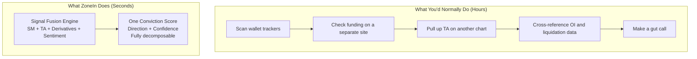
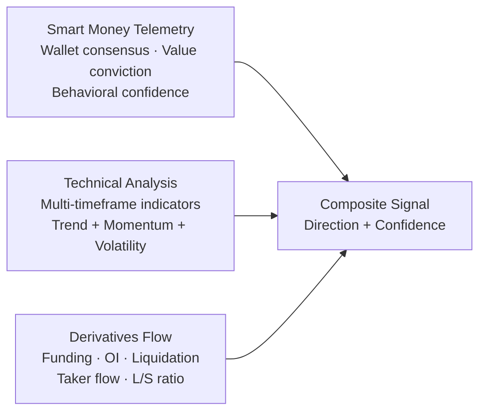

# Zonein AI‑Powered Dashboard

You're staring at a chart, deciding whether to go long. The RSI looks fine. The candles look fine. But you don't know that the sharpest wallets on Hyperliquid have been silently dumping for the past 6 hours, funding is about to flip negative, and a cluster of smart money liquidations sits exactly at the level you're about to enter.

The ZoneIn AI Dashboard **eliminates that blind spot**. It fuses real-time smart money telemetry, multi-timeframe technical structure, and derivatives flow into a single conviction score — and lets you decompose it all the way back to the specific wallets, the specific RSI reading, and the specific funding rate regime that produced it. Before the crowd notices.

# The Problem We Solve

Every trader faces the same bottleneck: **too many signals, not enough context.** Charts show price. Funding trackers show funding. Whale watchers show wallets. But nobody stitches them together into a single, unified picture that says _"here's where the edge is, here's why, and here's the evidence."_

```mermaid
flowchart TB
    subgraph "What You'd Normally Do (Hours)"
        A1[Scan wallet trackers] --> A2[Check funding on a separate site]
        A2 --> A3[Pull up TA on another chart]
        A3 --> A4[Cross-reference OI and liquidation data]
        A4 --> A5[Make a gut call]
    end

    subgraph "What ZoneIn Does (Seconds)"
        B1[Signal Fusion Engine<br/>SM + TA + Derivatives + Sentiment] --> B2[One Conviction Score<br/>Direction + Confidence<br/>Fully decomposable]
    end
```

The dashboard compresses the entire OODA loop — observe, orient, decide — into one screen. You open it, scan the ranked list, click an asset, and within seconds you know: what smart money is doing, whether technicals confirm it, what the derivatives environment looks like, and where the liquidation traps are.

# Where the Edge Lives — Four Markets, One View

The dashboard tracks signals across four asset classes on a single ranked view. The strongest conviction — where SM consensus, TA, and derivatives all converge — floats to the top.

## [**Perpetual Futures**](https://app.zonein.xyz/perp/)

The deepest signal stack. SM directional consensus cross-referenced with funding rate regime, open interest surges, liquidation clustering, and taker flow imbalance. When SM consensus aligns with a funding extreme and OI is spiking — that's the setup most retail traders discover too late.

## [**Spot Holdings**](https://app.zonein.xyz/spot)

What smart money is _holding_, not just trading. Spot accumulation often precedes perp momentum by days or weeks. When multiple high-credibility wallets quietly accumulate the same token before a narrative breaks — that's alpha the perp market hasn't priced in yet.

## [**HIP‑3 DEX Positions**](https://app.zonein.xyz/hip3)

Smart money on Hyperliquid's builder-deployed perpetual DEXes — a frontier most traders don't even monitor. Cross-DEX comparison reveals where the sharpest capital flows and where pricing inefficiencies emerge between venues.

## [**Prediction Markets**](https://app.zonein.xyz/pm)

Where the highest-ranked Polymarket traders are placing conviction bets on real-world outcomes. When top-ranked prediction market traders converge on an outcome that contradicts current odds — that's a probabilistic edge traditional markets haven't reflected yet.

# Deep Dive — The Token Detail Page

This is where the dashboard stops being a screener and becomes a **complete trading analysis environment**. Click any asset and you get everything you need to make a decision — or understand why the AI made one.

## See What Smart Money Is Doing — In Real Time

**The Composite Chart** layers three data streams on one timeline so you can answer the single most important question: _when SM conviction spiked, what did price do — and what was the funding rate environment?_

- **Price action** (OHLC candlesticks, 30-day window) gives you the structure
- **SM Strength** (green fill = LONG consensus, red fill = SHORT) shows you when the smartest wallets are aligned — and how strongly. Weak signals compress toward zero; strong signals pop
- **Funding Rate** (histogram bars) shows you the cost of the crowd's positioning — funding extremes often precede reversals

**SM Trade Flow Bubbles** are rendered directly on the chart — aggregated per hour, sized by volume, color-coded by direction. You see exactly _when_ smart money moved, _how much_ they moved, and _which direction_. Click any bubble and you get the specific wallets, their trade sizes, and links to their on-chain history.

This isn't a lagging indicator. It's a live window into what the sharpest capital is doing _right now_, overlaid on the same chart you'd normally stare at alone.

## Know Where the Liquidation Traps Are

Most liquidation data shows generic exchange-wide liquidations. That's noise.

The ZoneIn **SM Liquidation Heatmap** shows you where **smart money positions** would get liquidated — computed from their actual entry prices and leverage. You're seeing the vulnerability map of the smartest traders on-chain.

- **Heatmap bars on the chart** at each price level — hotter colors = more SM liquidation volume concentrated there
- **Dashed lines** marking average SM long and short liquidation prices
- **Click any bar** to see exactly which SM wallets are at risk: their address, position size, leverage, and unrealized PnL

**Why this matters for your trades:** If SM liquidations cluster tightly near current price, those wallets are over-leveraged and vulnerable — a wick in that direction could cascade. If liquidations are far away, SM is positioned with conviction and cushion. A dedicated **Liquidation Map Panel** breaks this down further: summary cards showing nearest liquidation distances, and price-bucketed distribution bars you can drill into per-wallet.

This context is invisible on any generic exchange liquidation chart. It's the difference between "there are liquidations somewhere" and "wallet 0xAb3F has a 10x long that liquidates 2.3% below current price."

## Decompose the Signal — Nothing Is a Black Box

The **Smart Money Analysis Panel** shows you the three independent scores that make up the composite conviction:

- **SM Score** — How strongly are the highest-credibility wallets aligned?
- **TA Score** — Does multi-timeframe technical structure confirm or contradict?
- **Market Score** — What does derivatives flow (funding, OI, liquidation, taker flow) say?

Plus the raw breakdown: total wallet count (Long / Short split), USD value per side, and consensus percentage. You can see _exactly_ why the signal says LONG — and decide whether you agree.

**RSI and Open Interest sub-charts** let you spot divergences the composite score alone won't show. RSI rising while price falls? OI spiking while price flatlines? These are the setups that precede the biggest moves.

## Read the Derivatives Pulse

A full derivatives dashboard loaded in real time — funding rate with directional label ("Longs pay Shorts"), open interest with 24h change, volume, liquidation breakdown, taker buy/sell ratio. Multi-timeframe context across 1H/4H/24H for OI changes and liquidation totals. Per-exchange breakdown so you can see where the action is concentrating.

This is the contrarian layer: extreme positive funding signals bearish overextension. A lopsided long/short ratio means a crowded trade ripe for a squeeze. You see it all in one place, in context with the SM signal above.

## Multi-Timeframe Technical Confirmation

A compact gauge grid shows key indicators per timeframe — RSI, Stochastic, ADX, MACD, SuperTrend — each with a color-coded directional label. At a glance, you know whether short-term momentum and longer-term trend structure agree or diverge.

# How the Conviction Score Works

Every signal you see is built from **multiple independent data sources**, fused through an adaptive weighting engine. Nothing is a black box — every component is visible and decomposable.

```mermaid
flowchart LR
    SM[Smart Money Telemetry<br/>Wallet consensus · Value conviction<br/>Behavioral confidence] --> COMP[Composite Signal<br/>Direction + Confidence]
    TA[Technical Analysis<br/>Multi-timeframe indicators<br/>Trend + Momentum + Volatility] --> COMP
    MKT[Derivatives Flow<br/>Funding · OI · Liquidation<br/>Taker flow · L/S ratio] --> COMP
```

**Smart Money Telemetry** is the primary signal source — what fraction of high-credibility wallets are long vs short, how much USD conviction is behind each direction, and how reliable the signal is based on the quality of contributing wallets.

**Technical Analysis** provides timing confirmation across multiple timeframes — when trend structure, momentum, and volatility indicators all align with SM consensus, conviction peaks.

**Derivatives Flow** is the contrarian and confirmation layer — funding extremes, OI surges, liquidation clustering, and taker flow imbalance. When the crowd is positioned one way and SM is positioned the other, something has to give.

The weighting between these sources is **not fixed**. It adapts per asset type and can be tuned per trading agent — a scalping agent weights short-timeframe TA heavily; a whale-following agent prioritizes SM consensus above all else.

# Why This Is Different

Other tools give you data. ZoneIn gives you **conviction with evidence**.

Every LONG signal on the dashboard can be traced back to: _these specific wallets_ went long with _this much conviction_, RSI is at _this level_, funding is _here_, OI just shifted _this way_, and SM liquidation levels are _this far_ from current price. You see the full picture — then decide whether to act on it yourself, or deploy an [agent](/features/trading-agents) that acts on the same signal at machine speed.

**Getting started.** Visit the [AI Dashboard](https://app.zonein.xyz) and explore signals across [perpetual futures](https://app.zonein.xyz/perp/), [spot](https://app.zonein.xyz/spot), [HIP-3](https://app.zonein.xyz/hip3), and [prediction markets](https://app.zonein.xyz/pm). Click any asset. See the evidence. Make better decisions — or let an agent make them for you.