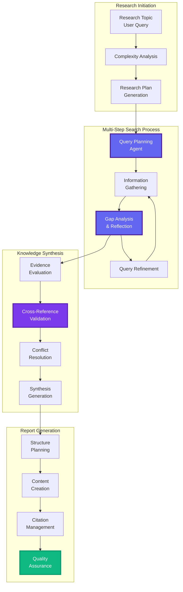
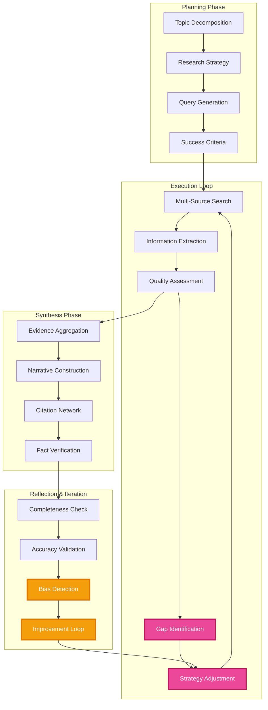
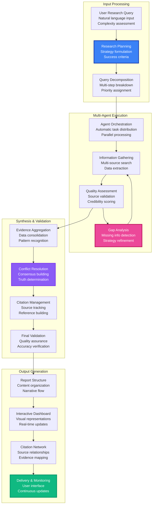

# Deep Research Engine

Zonein's Deep Research revolutionizes crypto analysis with an advanced AI workflow that mimics human analysts but operates at superhuman scale. Using multi-step reasoning, self-reflection, and iterative improvement, our system delivers institutional-grade research that would take teams weeks to complete.

## Advanced Research Workflow

## Self-Reflective Research Architecture

## Revolutionary Research Capabilities

### Multi-Hop Reasoning Engine

Our advanced reasoning system handles complex, interconnected questions:

**Example Research Query**: *"What are the top 5 DeFi protocols by TVL, their governance token performance, and correlation with major market events?"*

**Multi-Hop Process**:
1. **Step 1**: Identify current DeFi protocols by TVL
2. **Step 2**: Extract governance token information for each protocol
3. **Step 3**: Analyze token performance over time
4. **Step 4**: Correlate with major crypto market events
5. **Step 5**: Synthesize comprehensive analysis

### Self-Reflection & Quality Control

Advanced quality assurance through automated reflection:
- **Completeness Assessment**: Identifies missing information gaps
- **Accuracy Verification**: Cross-references multiple sources
- **Bias Detection**: Identifies potential research bias
- **Iterative Improvement**: Refines queries based on findings

### Model Context Protocol (MCP) Integration

Cutting-edge MCP integration for enhanced capability:
- **Standardized Tool Access**: Universal interface for research tools
- **Context Sharing**: Seamless information flow between agents
- **Resource Management**: Optimized compute allocation
- **Cross-Model Coordination**: Multiple LLMs working together

## Advanced Technical Architecture

### Complete Research Process Flow

### Advanced Data Processing Pipeline

**Real-Time Information Gathering**:
- **Multi-Chain Monitoring**: Live data from 50+ blockchains
- **Social Media Intelligence**: Real-time sentiment from 100+ platforms
- **News & Media Analysis**: AI-powered content analysis
- **Market Data Integration**: Price, volume, and derivatives data

**Information Quality Assessment**:
- **Source Credibility Scoring**: AI-based reliability assessment
- **Fact-Checking Pipeline**: Automated verification system
- **Bias Detection**: Multi-perspective analysis
- **Temporal Validation**: Time-sensitive information verification

### Iterative Research Loop

Our system employs a sophisticated feedback mechanism:

1. **Initial Research Phase**
   - Topic analysis and decomposition
   - Research strategy formulation
   - Initial query generation

2. **Information Gathering**
   - Multi-source data collection
   - Real-time blockchain analysis
   - Social sentiment mining
   - Historical pattern analysis

3. **Gap Analysis & Reflection**
   - Completeness assessment
   - Information quality evaluation
   - Bias and accuracy checking
   - Missing information identification

4. **Query Refinement**
   - Strategy adjustment based on findings
   - New search query generation
   - Source diversification
   - Depth vs. breadth optimization

5. **Synthesis & Validation**
   - Evidence aggregation
   - Conflict resolution
   - Cross-reference validation
   - Final quality assurance

## Breakthrough Features

### Multi-Modal Research Output

**Interactive Research Reports**:
- Executive summaries with key findings
- Detailed analysis with supporting evidence
- Visual data representations and charts
- Comprehensive citation networks

**Dynamic Research Updates**:
- Real-time report updates as new information emerges
- Change tracking and version control
- Alert systems for significant developments
- Collaborative annotation and comments

### Advanced Citation Management

**Intelligent Source Tracking**:
- Automatic citation generation
- Source credibility assessment
- Information provenance tracking
- Conflict detection and resolution

**Evidence Quality Scoring**:
- Primary vs. secondary source identification
- Recency and relevance weighting
- Cross-reference validation scores
- Bias and reliability indicators

## Research Specializations

### Tokenomics Deep Dive
- Token distribution analysis
- Vesting schedule evaluation
- Utility and value capture assessment
- Governance mechanism analysis

### Protocol Risk Assessment
- Smart contract vulnerability analysis
- Economic attack vector identification
- Governance risk evaluation
- Operational security assessment

### Market Intelligence
- Competitive landscape mapping
- Adoption metric analysis
- Network effect evaluation
- Growth trajectory modeling

### Regulatory Analysis
- Compliance status assessment
- Regulatory risk identification
- Geographic restriction analysis
- Legal precedent tracking

## Benefits for Different Users

### For Investors
- **Professional-Grade Research**: Institutional quality for investors
- **Time-Efficient Analysis**: Hours of research completed in minutes
- **Unbiased Insights**: AI-driven objectivity without human bias
- **Continuous Monitoring**: Ongoing analysis and updates

### For Project Teams
- **Competitive Intelligence**: Deep analysis of market positioning
- **Risk Identification**: Potential threats and vulnerabilities
- **Market Research**: User sentiment and adoption patterns
- **Strategic Planning**: Data-driven decision support

### For Researchers and Analysts
- **Accelerated Research**: AI-powered research assistant
- **Comprehensive Coverage**: Multi-faceted analysis approach
- **Quality Assurance**: Built-in fact-checking and validation
- **Citation Management**: Automated source tracking and referencing

## Technology Stack

### Core AI Infrastructure
- **Multi-Agent Framework**: Specialized research agents with distinct roles
- **LLM Orchestration**: Multiple models optimized for different tasks
- **Reinforcement Learning**: Self-improving research strategies
- **Neural Architecture Search**: Automated model optimization

### Advanced Reasoning Systems
- **Multi-Hop Reasoning**: Complex question decomposition and synthesis
- **Causal Inference**: Understanding cause-and-effect relationships
- **Temporal Reasoning**: Time-aware analysis and trend identification
- **Counterfactual Analysis**: "What-if" scenario modeling

### Workflow Orchestration Platform
- **LangGraph Integration**: Advanced workflow orchestration and state management
- **Parallel Processing**: Concurrent research operations across multiple agents
- **Dynamic Routing**: Intelligent task distribution based on agent capabilities
- **State Persistence**: Maintaining research context across long-running operations

### Search & Data Platform
- **Tavily Search Engine**: Advanced web search with real-time indexing
- **Multi-Chain Data Feeds**: Live blockchain and market data streams
- **Social Intelligence APIs**: Sentiment and influence tracking across platforms
- **Knowledge Graph Network**: Entity relationship mapping and semantic understanding

### Quality Assurance Framework
- **Multi-Source Validation**: Cross-reference verification system
- **Bias Detection**: Automated fairness and objectivity checking
- **Fact-Checking Pipeline**: Real-time information verification
- **Uncertainty Quantification**: Confidence scoring for all findings

### Collaborative Research Infrastructure
- **Real-Time Collaboration**: Multiple AI agents working simultaneously
- **Consensus Mechanisms**: Multi-agent agreement protocols
- **Context Sharing**: Seamless information flow between research components
- **Version Control**: Research iteration tracking and rollback capabilities

## Competitive Advantages

### vs. Traditional Crypto Research
**Manual Analyst Approach:**
- **Time**: Manual research takes 40-80 hours per deep dive
- **Coverage**: Limited to 10-20 sources due to time constraints
- **Bias**: Analyst preconceptions influence conclusions
- **Staleness**: Reports outdated within days of publication

**Zonein's Autonomous Advantage:**
- **Speed**: Complete analysis in 15-30 minutes with real-time updates
- **Scale**: Simultaneously processes 1000+ sources across chains
- **Objectivity**: AI eliminates emotional and confirmation bias
- **Freshness**: Continuous updates as new information emerges

### vs. Generic AI Research Tools
**ChatGPT, Claude, Perplexity:**
- **Knowledge Cutoff**: Training data ends months/years ago
- **Surface Level**: Cannot perform true multi-hop reasoning
- **No Specialization**: Generic responses lack crypto expertise
- **Static Output**: Single response with no iteration or improvement

**Zonein's Specialized Intelligence:**
- **Live Data**: Real-time blockchain, social, and market integration
- **Crypto-Native**: Purpose-built for DeFi, tokenomics, and on-chain analysis
- **Multi-Agent Coordination**: Specialized agents for different research domains
- **Iterative Refinement**: Self-improving research through gap analysis

### vs. Crypto Research Platforms
**Messari, DeFiPulse, CoinGecko Research:**
- **Static Reports**: Pre-written content with limited customization
- **Broad Focus**: General market analysis, not personalized insights
- **Manual Updates**: Research teams create content on fixed schedules
- **No Interactivity**: Cannot adjust research based on your specific needs

**Zonein's Dynamic Approach:**
- **Personalized Research**: Tailored to your portfolio and investment thesis
- **Interactive Queries**: Ask follow-up questions and drill down into specifics
- **Real-Time Synthesis**: Generate reports on emerging topics within minutes
- **Portfolio Context**: Analysis considers your existing holdings and risk profile

### vs. Traditional Financial Research
**Goldman Sachs, JPM, Traditional Analysts:**
- **Cost**: Research reports cost $10,000-$50,000+ per piece
- **Access**: Limited to institutional clients and high-net-worth individuals
- **Crypto Expertise**: Traditional finance analysts lack deep crypto knowledge
- **Regulatory Bias**: Conservative viewpoints due to compliance requirements

**Zonein's Democratized Intelligence:**
- **Accessible Pricing**: Institutional-grade research at retail-friendly prices
- **Open Access**: Available to all users regardless of portfolio size
- **Native Expertise**: Built specifically for crypto markets and DeFi protocols
- **Unbiased Analysis**: No regulatory constraints on investment recommendations

## Unique Value Propositions

### Technical Differentiation
- **Blockchain-Native LLMs**: AI models trained specifically on crypto data
- **Multi-Chain Integration**: Unified analysis across 50+ blockchains
- **Real-Time Processing**: Live updates as market conditions change
- **Advanced Reasoning**: Causal analysis and multi-hop logical connections

### Business Model Innovation
- **Pay-Per-Query**: Only pay for research you actually use
- **Transparent Sourcing**: Full citation trail for every conclusion
- **Customizable Depth**: Choose between quick insights and comprehensive analysis
- **Collaborative Intelligence**: Your feedback improves the system for everyone

### Crypto Market Focus
- **DeFi Expertise**: Deep understanding of yield farming, liquidity provision, impermanent loss
- **Tokenomics Analysis**: Automated evaluation of token distribution, vesting, and utility
- **On-Chain Intelligence**: Direct analysis of smart contracts and transaction patterns
- **Cross-Protocol Insights**: Understanding relationships between different DeFi protocols

## Future Capabilities

### Advanced AI Features
- **Predictive Research**: Anticipating future research needs
- **Collaborative AI**: Multiple AI systems working together
- **Adaptive Learning**: Personalized research methodologies
- **Creative Synthesis**: Novel insight generation

### Enhanced Integration
- **Real-Time Market Integration**: Live trading and market data
- **Social Network Analysis**: Deep social signal processing
- **Regulatory Compliance**: Automated compliance checking
- **Cross-Chain Intelligence**: Unified multi-blockchain analysis

---

## Experience Deep Research Today

Ready to revolutionize your crypto research process? 

**Join thousands of investors, analysts, and researchers** who trust Zonein's Deep Research for critical investment decisions and market analysis.

**What makes us different:**
- AI that thinks and reasons like top analysts
- Faster, more comprehensive, and completely unbiased
- No setup, no deployment, no technical complexity
- Institutional-grade research at your fingertips

Simply ask your question and let our AI agents do the heavy lifting. Experience the future of crypto research today. 