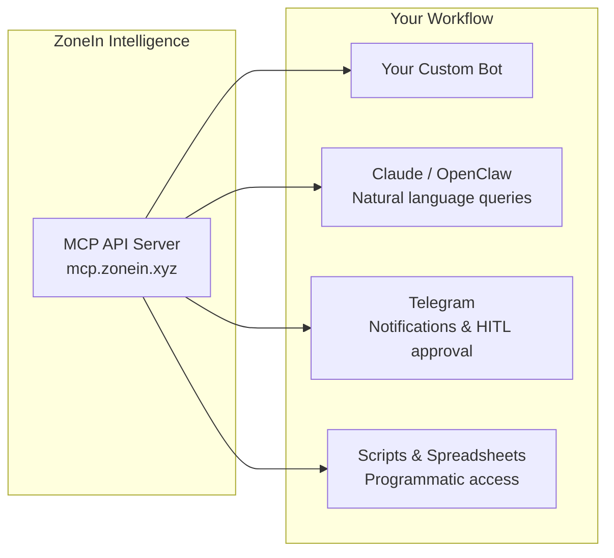
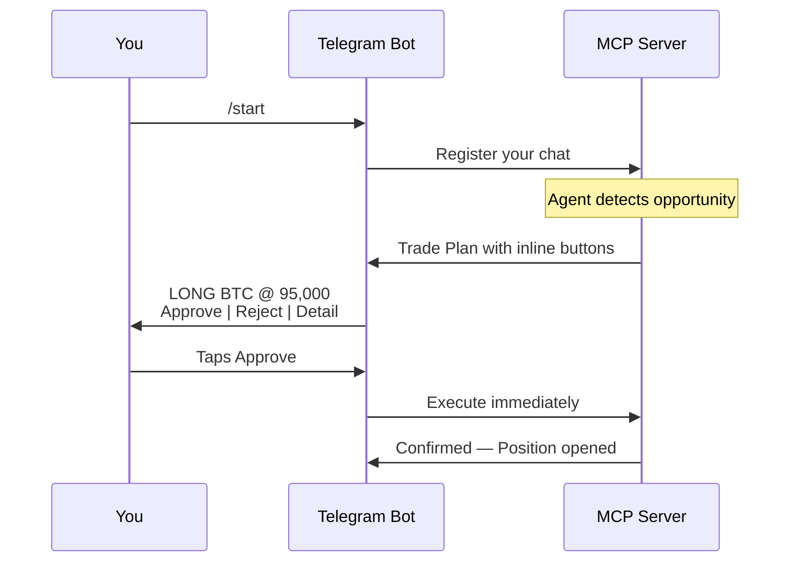

# Zonein MCP API & AI Integrations

You've built a custom bot. Or you use Claude for research. Or you want your Telegram to ping you when whales move. The signal exists in ZoneIn's intelligence layer — but your workflow lives somewhere else.

The MCP API bridges that gap. It exposes **every signal, every wallet profile, and every agent operation** through a REST API, an MCP protocol for AI assistants, and a Telegram bot for instant notifications. The same validated data that powers the [AI Dashboard](https://app.zonein.xyz) and [Position Graphs](https://app.zonein.xyz/perp/) — available programmatically, in your tools, on your terms.

Query smart money consensus in an API call. Deploy an agent with a Telegram message. Approve a trade plan with a single button press. This is where ZoneIn stops being a dashboard and becomes **infrastructure**.

# Why This Matters

The best trading intelligence is useless if it's locked inside one interface. Traders use different tools — some prefer custom scripts, some prefer AI assistants, some live in Telegram. The API makes ZoneIn's intelligence layer **composable**: plug it into whatever workflow already works for you.

# Four Ways In

## REST API — Full Programmatic Access

Every signal, every trader profile, every agent operation. Fully documented at [mcp.zonein.xyz/docs](https://mcp.zonein.xyz/docs) with Swagger UI.

**What you can query:**

- **AI Signals** — Composite conviction scores across perp, spot, HIP-3, and prediction markets. Full asset detail with 30-day history. OHLC candles, funding history, SM trade flow, liquidation maps
- **Smart Money** — Perp signals per coin, SM trade aggregations, top performers, individual trader profiles. PM leaderboards, consensus, similarity analysis
- **Derivatives** — OI, funding, L/S ratio, liquidation, taker flow, Fear & Greed Index
- **Technical Analysis** — Multi-timeframe indicators (RSI, MACD, SuperTrend, ADX, BB, EMA, SMA, ATR, VWAP, and more) — single symbol or bulk query
- **Agent Management** — Full lifecycle: create, deploy, enable, disable, delete. Vault management, manual orders, trade plans, performance stats, backtesting
- **Backtesting** — Run simulations, list results, view interactive dashboards

**Public endpoints** (no auth): Dashboard signals, derivatives, TA, Fear & Greed. **Authenticated endpoints**: SM data, PM data, agent management. API keys use the `zn_` prefix via `X-API-Key` header.

## Telegram Bot — Trade Notifications & One-Tap Approval

The fastest path from signal to action. Two minutes to set up, zero ongoing cost.

**For auto agents:** You get informational messages — position opened, closed, PnL.

**For HITL agents:** Each trade plan arrives with **Approve / Reject / Detail** buttons. One tap to execute. No LLM call, no delay, no cost. Compare this to approving via chat (which requires an LLM invocation) — Telegram is instant and free.

**Setup:** Create a bot via @BotFather → run `telegram-setup --token YOUR_TOKEN` → send `/start`. That's it.

## AI Assistants — Ask Questions in Natural Language

The MCP stdio server exposes ZoneIn as structured tools that AI assistants can discover and invoke automatically:

- **OpenClaw**: Install the ZoneIn skill. Ask _"What's the SM consensus on ETH?"_ or _"Create a BTC momentum agent"_ — the skill handles authentication, formatting, and response parsing
- **Claude Desktop**: Configure the MCP server in settings. Claude discovers all available tools automatically. Ask anything about signals, traders, or agents

Every command available via REST is available via natural language. Financial commands are safety-gated — the assistant must present a summary and get your explicit `--confirm` before executing.

## Custom Integrations — Build Whatever You Need

The REST API is your building block. Some things people build:

- **Custom dashboards** on top of ZoneIn's signal stream
- **Multi-agent orchestration** — different strategies consuming the same intelligence
- **Alert systems** — trigger notifications when specific SM conditions are met
- **Spreadsheet integrations** — pull signals into your existing analysis workflow
- **Cross-platform bots** — plug ZoneIn signals into Discord, Slack, or any messaging platform

# Getting Started

**REST API:**
1. Get your API key from [app.zonein.xyz](https://app.zonein.xyz)
2. Browse endpoints at [mcp.zonein.xyz/docs](https://mcp.zonein.xyz/docs)
3. First call: `curl -H "X-API-Key: zn_your_key" https://mcp.zonein.xyz/api/v1/perp/signals`

**Telegram:**
1. Create a bot via @BotFather
2. `telegram-setup --token YOUR_TOKEN`
3. Send `/start` to your bot — notifications start immediately

**OpenClaw / Claude:**
1. Install skill or configure MCP server
2. Your API key is auto-read from config
3. Start asking questions in natural language

# Web3 Trust & Payments (Roadmap)

The API is designed to evolve beyond API keys into a fully Web3-native intelligence marketplace:

- **Pay-Per-Request (x402)** — Micropayments for premium signals. No subscriptions — pay per API call with stablecoin settlement. Signal quality determines revenue in a true intelligence marketplace
- **Verifiable Agent Reputation (ERC-8004)** — Every agent gets an on-chain identity with auditable performance history. Portable reputation that follows agents across platforms — solving the trust gap in copy-trading and alpha bots

# Why This Is Different

Most platforms give you a dashboard. ZoneIn gives you an **intelligence API** — the same signal stack that powers the dashboard, the graphs, and the agents, available for whatever you want to build. The intelligence layer is the product. How you consume it is up to you.
