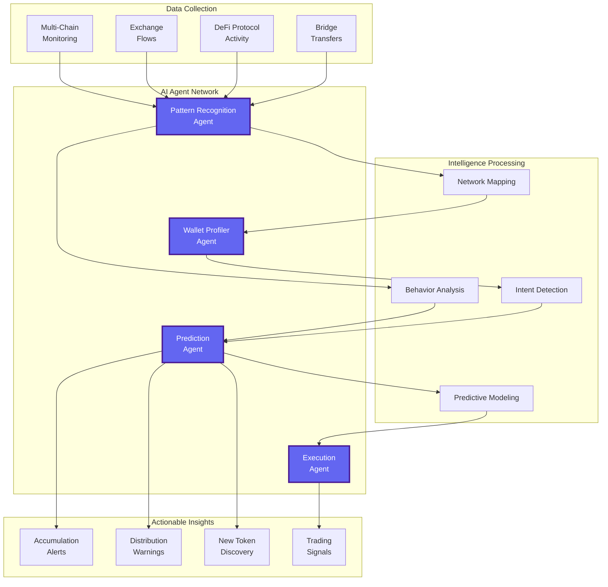
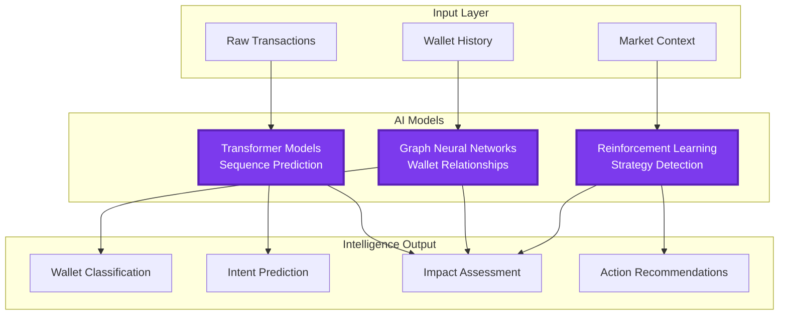

# Smart Money Tracking System

Zonein's Smart Money Tracking deploys sophisticated AI agents that monitor, analyze, and predict whale wallet movements in real-time. Our system doesn't just track - it understands intent, predicts actions, and executes strategies based on institutional behavior patterns.

## How It Works

## Advanced AI Processing Pipeline

## Revolutionary Capabilities

### Predictive Whale Analytics

Our AI doesn't just track - it predicts:
- **Movement Prediction**: Anticipate whale actions before they happen
- **Accumulation Patterns**: Identify early-stage position building
- **Distribution Signals**: Detect selling patterns before dumps
- **Market Impact Analysis**: Predict price effects of whale movements

### Intelligent Wallet Profiling

Advanced AI classification of wallet types:
- **Venture Capital Wallets**: Track institutional investment patterns
- **Market Makers**: Monitor liquidity provider behaviors
- **Smart Traders**: Follow consistently profitable wallets
- **Project Treasuries**: Track team and foundation movements
- **Exchange Wallets**: Monitor inflows/outflows for sentiment

### Multi-Chain Intelligence

Comprehensive cross-chain tracking:
- **Bridge Monitoring**: Track assets moving between chains
- **Cross-Chain Arbitrage**: Identify multi-chain opportunities
- **Liquidity Migration**: Follow capital flows across ecosystems
- **Chain-Specific Patterns**: Understand unique blockchain behaviors

### Behavioral Pattern Recognition

AI-powered behavior analysis:
- **Trading Strategies**: Identify and classify trading patterns
- **Risk Profiles**: Understand wallet risk tolerance
- **Time-Based Patterns**: Detect trading schedules and habits
- **Coordination Detection**: Identify synchronized wallet movements

## Advanced Features

### Real-Time Intent Detection
Our AI analyzes transaction patterns to understand intent:
- **Accumulation Intent**: Building long-term positions
- **Distribution Intent**: Preparing to sell holdings
- **Arbitrage Intent**: Quick profit-taking patterns
- **Manipulation Intent**: Wash trading or price manipulation

### Predictive Alerts
Get ahead of the market with AI predictions:
- **Pre-Accumulation Signals**: Before whales start buying
- **Exit Predictions**: Anticipate distribution phases
- **Trend Reversal Warnings**: Detect sentiment shifts early
- **Opportunity Forecasts**: Predict next whale targets

### Network Analysis
Understand the relationships between wallets:
- **Wallet Clustering**: Identify connected wallet groups
- **Influence Mapping**: Track opinion leaders and followers
- **Money Flow Visualization**: See capital movement patterns
- **Coordination Detection**: Spot orchestrated movements

### Smart Execution
Automated response to whale activities:
- **Copy Trading**: Automatically follow profitable wallets
- **Front-Running Protection**: Avoid being exit liquidity
- **Strategic Positioning**: Enter/exit based on whale behavior
- **Risk Management**: Automatic stop-losses based on whale exits

## Tracking Capabilities

### Wallet Categories

**Tier 1: Institutional Wallets**
- Venture capital firms
- Hedge funds
- Trading desks
- Market makers

**Tier 2: Smart Money**
- Consistently profitable traders
- Early adopters
- DeFi power users
- NFT collectors

**Tier 3: Project Insiders**
- Team wallets
- Advisor holdings
- Foundation treasuries
- Vesting contracts

### Transaction Intelligence
- **Size Analysis**: Large transactions and their impact
- **Timing Patterns**: When smart money moves
- **Destination Tracking**: Where funds are going
- **Source Analysis**: Origin of new capital

### DeFi Activity Monitoring
- Lending/borrowing positions
- Liquidity provision tracking
- Yield farming strategies
- Governance participation

## Benefits

### For Active Traders
- **Alpha Generation**: Trade alongside the smartest money
- **Risk Mitigation**: Exit before whale dumps
- **Opportunity Discovery**: Find tokens before mainstream
- **Strategy Validation**: Confirm your thesis with whale data

### For Long-Term Investors
- **Accumulation Timing**: Buy when whales buy
- **Distribution Warnings**: Protect gains from dumps
- **Project Validation**: See if smart money believes
- **Portfolio Optimization**: Follow institutional strategies

### For DeFi Users
- **Yield Optimization**: Follow whale farming strategies
- **Protocol Selection**: Use protocols whales trust
- **Risk Assessment**: Avoid protocols whales abandon
- **Timing Strategies**: Enter/exit with smart money

## Technology Infrastructure

### Core AI Systems
- **Transformer Networks**: For sequence prediction and pattern recognition
- **Graph Neural Networks**: For wallet relationship mapping
- **Reinforcement Learning**: For strategy identification
- **Ensemble Models**: Combined predictions for accuracy

### Real-Time Processing
- **Stream Processing**: Instant transaction analysis
- **Parallel Computing**: Track thousands of wallets simultaneously
- **Edge Computing**: Ultra-low latency alerts
- **Distributed Architecture**: Global monitoring network

### Data Pipeline
- **Multi-Chain Integration**: All major blockchains supported
- **Exchange APIs**: CEX flow monitoring
- **Mempool Analysis**: Pre-confirmation detection
- **Historical Data**: Years of whale behavior patterns

## Success Stories

### Early Token Discovery
- Identified accumulation patterns days before pumps
- Tracked VC wallets finding next unicorns
- Discovered hidden gems through wallet analysis

### Risk Avoidance
- Predicted major dumps with high accuracy
- Identified rug pulls before they happened
- Warned users of protocol exploits early

### Strategy Optimization
- Improved trading returns by following smart wallets
- Enhanced yield farming through whale strategies
- Better entry/exit timing based on institutional flows

## Competitive Advantages

### vs. Basic Whale Tracking Tools
**Whale Alert, WhaleStats, DeBank:**
- **Reactive Only**: Shows transactions after they happen with no predictive ability
- **Simple Alerts**: Basic notifications without context or strategy implications
- **No Intelligence**: Raw data display without behavioral analysis or intent detection
- **Manual Analysis**: Users must interpret data and make decisions themselves

**Zonein's Predictive Intelligence:**
- **Future-Focused**: Predicts whale movements before they execute
- **Contextual Analysis**: Explains why movements matter and what they indicate
- **AI-Powered Insights**: Advanced behavioral analysis and pattern recognition
- **Actionable Recommendations**: Specific trading strategies based on whale activity

### vs. Traditional Market Analytics
**Bloomberg Terminal, Refinitiv, TradingView:**
- **Limited Crypto Data**: Primarily focused on traditional markets
- **No Wallet-Level Intelligence**: Cannot track individual investor behaviors
- **Expensive Access**: $20,000-$50,000+ annual subscriptions
- **Institutional Only**: Limited accessibility for retail investors

**Zonein's Democratized Intelligence:**
- **Crypto-Native**: Purpose-built for blockchain and DeFi analysis
- **Granular Tracking**: Individual wallet and transaction-level intelligence
- **Accessible Pricing**: Institutional-grade intelligence at retail prices
- **Equal Access**: Same tools available to all users regardless of portfolio size

### vs. Copy Trading Platforms
**eToro, Mirror Trading, 3Commas:**
- **Human Traders Only**: Dependent on individual trader performance and emotions
- **Limited Transparency**: Cannot see the reasoning behind trades
- **Platform Risk**: Traders can leave or change strategies unexpectedly
- **Generic Copying**: Blindly following without understanding market context

**Zonein's Intelligent Following:**
- **Systematic Approach**: Follows wallet patterns, not individual emotions
- **Complete Transparency**: Full visibility into wallet history and strategy rationale
- **Diversified Intelligence**: Tracks hundreds of successful wallets simultaneously
- **Adaptive Learning**: Adjusts following strategies based on market conditions

### vs. Social Sentiment Tools
**LunarCrush, Santiment, The TIE:**
- **Surface-Level Analysis**: Basic sentiment scores without deeper insights
- **Lagging Indicators**: Social sentiment often follows price action
- **Noise vs Signal**: Difficulty filtering meaningful data from social chatter
- **No Execution Context**: Sentiment data without actionable trading strategies

**Zonein's Behavioral Intelligence:**
- **Action-Based Analysis**: Focuses on actual wallet behavior, not social noise
- **Leading Indicators**: Wallet movements often precede social awareness
- **High Signal Quality**: AI filters for meaningful patterns and genuine activity
- **Execution Ready**: Converts behavioral insights into specific trading recommendations

### vs. On-Chain Analytics Platforms
**Glassnode, IntoTheBlock, Dune Analytics:**
- **Macro Focus**: Broad market metrics without individual wallet intelligence
- **Historical Data**: Strong on past trends but limited predictive capability
- **Technical Complexity**: Requires deep analytical skills to interpret data
- **Static Reports**: Pre-built dashboards with limited customization

**Zonein's Dynamic Intelligence:**
- **Micro and Macro**: Combines individual wallet behavior with market-wide patterns
- **Predictive Models**: AI forecasts future movements based on current patterns
- **User-Friendly Interface**: Complex analysis simplified into actionable insights
- **Real-Time Adaptation**: Continuously updating predictions and recommendations

### vs. Traditional Technical Analysis
**Manual Chart Analysis, Indicators, Trading Bots:**
- **Price-Only Focus**: Limited to price and volume data without market participant insight
- **Historical Patterns**: Relies on past price patterns that may not repeat
- **No Intent Understanding**: Cannot determine why movements are happening
- **Retail Perspective**: Same tools available to everyone create crowded trades

**Zonein's Insider Intelligence:**
- **Participant Behavior**: Understands who is moving the market and why
- **Predictive Patterns**: AI identifies recurring behavioral patterns across time
- **Intent Detection**: Knows whether movements are accumulation, distribution, or manipulation
- **Information Advantage**: Accesses data and insights not available to typical retail traders

## Unique Value Propositions

### Technological Superiority
- **Multi-Chain Intelligence**: Unified tracking across 50+ blockchains and bridges
- **Real-Time Processing**: Sub-second analysis of new transactions and patterns
- **AI Model Ensemble**: Combined power of transformer, graph, and reinforcement learning models
- **Behavioral Prediction**: Industry-leading accuracy in predicting wallet actions

### Business Model Innovation
- **Performance-Based Success**: Our profits align with your trading success
- **Transparent Methodology**: Full explanation of how predictions are generated
- **Continuous Learning**: System improves from every user interaction and market outcome
- **Community Intelligence**: Collective insights benefit all platform users

### Market Intelligence Focus
- **Institutional Grade**: Same quality of intelligence used by hedge funds and VCs
- **DeFi Specialization**: Deep understanding of yield farming, liquidity provision, and protocol governance
- **MEV Awareness**: Protection from and participation in Maximum Extractable Value opportunities
- **Cross-Protocol Insights**: Understanding how smart money moves between different DeFi protocols

Transform your trading with AI that sees what others can't. Track, predict, and profit from smart money movements with Zonein's advanced whale intelligence system. 