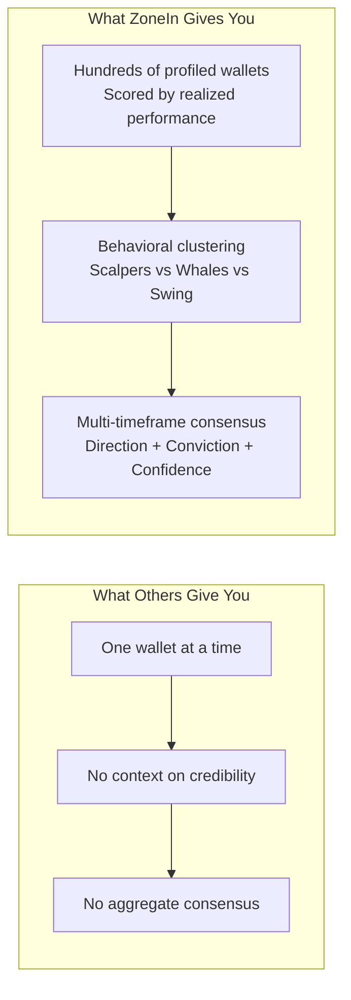
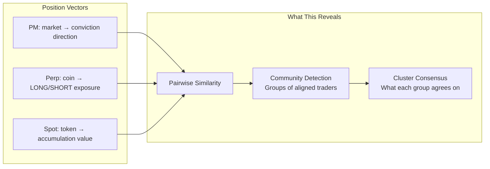

# Zonein Smart Money Telemetry

You're watching a chart. The candles are green. Twitter is bullish. But behind the scenes, the wallets that actually _make money_ on Hyperliquid — the ones with proven track records — are quietly closing their longs and flipping short.

You won't see this on any chart. You won't see it on Twitter. But it's the signal that matters most.

ZoneIn's smart money engine is the foundation of every signal the platform produces. It continuously profiles, categorizes, and tracks the highest-conviction wallets on Hyperliquid and the top-ranked traders on Polymarket — not by follower count or self-reported claims, but by **realized trading performance**. Their collective consensus — what they're buying, selling, and with how much conviction — becomes the primary signal backbone that drives the [AI Dashboard](https://app.zonein.xyz), [Position Graphs](https://app.zonein.xyz/perp/), and Trading Agents.

# Why This Matters

Single-wallet trackers show you one address at a time. Social sentiment shows you what people _say_. Neither tells you what the sharpest capital is _actually doing_ in aggregate.

```mermaid
flowchart LR
    subgraph "What Others Give You"
        A1[One wallet at a time] --> A2[No context on credibility]
        A2 --> A3[No aggregate consensus]
    end

    subgraph "What ZoneIn Gives You"
        B1[Hundreds of profiled wallets<br/>Scored by realized performance] --> B2[Behavioral clustering<br/>Scalpers vs Whales vs Swing]
        B2 --> B3[Multi-timeframe consensus<br/>Direction + Conviction + Confidence]
    end
```

The difference: when a random wallet goes long, it's noise. When dozens of the highest-credibility wallets on Hyperliquid converge on the same direction — across multiple timeframes — **that's institutional-grade signal**. And when they diverge, it's a warning worth heeding.

# How We Profile Wallets

Every tracked wallet is characterized by **realized trading behavior** — not reputation, not following, not Twitter alpha. The system classifies wallets into behavioral clusters that expand as new patterns emerge:

- **Scalpers & Short-Term Traders** — Quick in-and-out, sub-day holds. Their signal is fast and noisy, but valuable for timing
- **Swing & Trend Traders** — Multi-day to multi-week holds. When these wallets move, they've done their homework
- **Momentum Players** — Aggressive sizing on volume surges. They ride waves hard and early
- **Whale Followers & Contrarians** — Large-cap focused or deliberately counter-consensus. The contrarians are often the smartest in the room
- **High Win-Rate & Stable** — Consistently profitable with controlled drawdowns. The gold standard
- **Asset Specialists** — Concentrated in specific assets or sectors. When a BTC specialist goes all-in, pay attention

**Why this matters for you:** A scalper flipping a position isn't the same signal as a whale accumulating. The system knows the difference and weights their contributions accordingly. Credibility scoring uses a multi-factor model — realized ROI, win rate, profit factor, consistency, volume, trade frequency, hold patterns. High scores reflect sustained edge, not lucky streaks.

# Multi-Timeframe Consensus — The Core Signal

For each tracked asset, the engine computes **directional consensus across multiple timeframes**:

- **Short-term** — Rapid sentiment shifts. Best for scalping confirmation and spotting early entries before they become obvious
- **Medium-term** — Balanced between noise and conviction. The core momentum signal
- **Longer-term** — Most stable, highest wallet count. When this flips, the trend is real

Each timeframe reports wallet count, directional split, USD volume per side, and consensus ratio. The signal blends timeframes with **adaptive weighting** — a scalping agent emphasizes short-term; a swing agent emphasizes longer-term. You choose the lens.

When multiple timeframes converge on the same direction — short-term, medium-term, and long-term all saying LONG — that's maximum conviction. When they diverge, something is shifting and it's time to be cautious.

# Where You See This Edge

## [**Perpetual Futures**](https://app.zonein.xyz/perp/) — The Richest Signal Layer

Per-coin directional consensus, wallet count, long/short value split. Top performers ranked by PnL. Coin distribution showing where smart money attention is concentrating. Individual trader profiles with full position history.

When the highest-credibility perp traders converge on LONG BTC with rising leverage — while funding remains neutral — that's the setup most retail traders discover days too late.

## [**Spot Holdings**](https://app.zonein.xyz/spot) — The Early Warning System

What smart money is _holding_, not just trading. Spot accumulation often precedes perp momentum by days or weeks. Per-token PnL distribution reveals whether holders are early (in profit) or late (underwater).

A token silently accumulated by many high-credibility wallets — with most holders in profit — is a fundamentally different trade than a token being momentum-chased on perps. You see the difference here before anyone else.

## [**HIP-3 DEX**](https://app.zonein.xyz/hip3) — The Frontier Nobody Watches

Smart money on Hyperliquid's builder-deployed perpetual DEXes — venues most traders don't even know exist. Cross-DEX comparison reveals where the sharpest capital flows and where pricing inefficiencies emerge.

Being first to see these flows gives you edge on assets that haven't even appeared on mainstream dashboards.

## [**Prediction Markets**](https://app.zonein.xyz/pm) — Collective Intelligence on Real-World Outcomes

Consensus from the highest-ranked Polymarket traders — people with verifiable track records on real-world outcome prediction. When top-ranked traders converge on an outcome that contradicts current odds, that's a probabilistic edge derived from collective intelligence, not speculation.

# Going Deeper — Behavioral Analysis

Beyond consensus, the system performs **deep behavioral characterization** per wallet — useful for understanding _why_ a trader's signals work, not just _that_ they work:

- **Risk Profile** — Position concentration, leverage patterns, tail risk exposure. Are they careful or reckless?
- **Timing Intelligence** — Do they enter early before moves or late chasing momentum? How long do they hold?
- **Market Selection** — Do they specialize or diversify? Category preferences reveal strategic intent
- **Performance Decomposition** — Streaks, per-category hit rates, drawdown behavior, recovery speed
- **Automated Style Classification** — Whale, consistent winner, high frequency, scalper, long-term holder — with tiered skill levels

This analysis enriches every surface: [Position Graph](https://app.zonein.xyz/perp/) tooltips, API trader profiles, and agent signal context. Before you follow any wallet's signal, you can evaluate their full track record.

# Hidden Groups — Similarity & Cluster Detection

Single-wallet tracking misses the most valuable signal: **coordinated conviction**. Three similarity engines compute position correlation between traders, revealing hidden groups of aligned wallets:

```mermaid
flowchart LR
    subgraph "Position Vectors"
        PV1[PM: market → conviction direction]
        PV2[Perp: coin → LONG/SHORT exposure]
        PV3[Spot: token → accumulation value]
    end

    subgraph "What This Reveals"
        CS[Pairwise Similarity] --> COMM[Community Detection<br/>Groups of aligned traders]
        COMM --> CONSENSUS[Cluster Consensus<br/>What each group agrees on]
    end

    PV1 --> CS
    PV2 --> CS
    PV3 --> CS
```

- **Perp clusters** — Groups of traders with aligned directional exposure across multiple coins. When a cluster of top performers all go LONG on the same asset, that's not coincidence
- **Spot clusters** — Wallets accumulating the same tokens independently. Potential early-stage consensus forming before price moves
- **PM clusters** — Prediction market traders betting on the same outcomes. Institutional-grade conviction on real-world events

When a high-credibility cluster aligns on a position, that signal carries far more weight than any single wallet. This is the intelligence layer that makes ZoneIn fundamentally different from a wallet tracker.

# Why This Is Different

Other tools show you _what_ wallets are doing. ZoneIn tells you _who_ is doing it (credibility score), _how_ they trade (behavioral profile), _whether_ they agree (multi-timeframe consensus), and _who else_ agrees with them (cluster detection). Every signal is traceable to specific wallets and positions — evidence you can audit, not a black box.

**Getting started.** Open the [AI Dashboard](https://app.zonein.xyz) and click any asset. The SM breakdown shows you exactly how many high-credibility wallets are long, how many are short, and how much conviction is behind each direction. Or explore the [Position Graphs](https://app.zonein.xyz/perp/) to see the full flow topology — every wallet, every position, every connection.