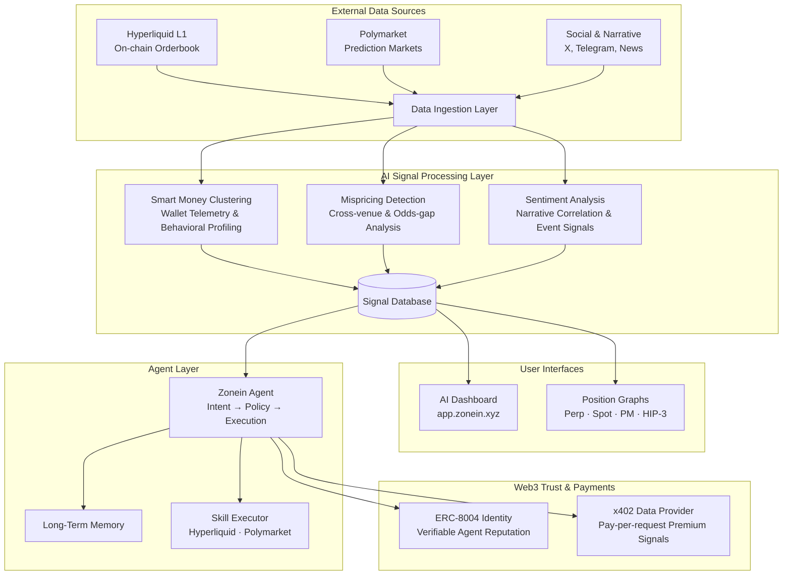

**Zone In. Think faster. Act earlier.**

## The Big, Unstoppable Shift

The crypto market as we knew it is over, reshaped by two powerful forces: three years of relentless macro liquidity tightening and the rise of AI as the dominant tech narrative.

In prior cycles, the playbook was simple. Capital flowed from private venture deals into public exchanges like Binance, Coinbase, and OKX. As a token transitioned from an illiquid private market to a liquid public venue, the wealth effect followed—prices pumped, and the pattern repeated from token to token until the cycle ended.

That game stopped in 2022 as the US Fed tightened its grip and liquidity evaporated from risk-on markets. Capital froze and fled to safer, more dominant narratives, primarily AI, which quickly became the future of the consumer internet instead of the Web3 narrative. (Every app is now integrating AI instead of blockchain.)

Crypto VCs, now unable to raise new funds, were forced to exit prior deals at all costs, killing the wealth effect and slaughtering the portfolios of any crypto traders still holding on to the "alt-season will pump my bag" thesis.

However, the speculative energy didn't disappear. Traders just moved from unprofitable venues to new arenas with higher perceived odds: on-chain casinos. The action shifted to environments with no KYC and low latency (i.e., Hyperliquid and Solana launchpads like pump.fun), where a token's lifecycle unfolds in days or hours, not months or weeks. This is the new normal.

**The edge for traders now lies in precision (choosing the right coins) and processing speed (buying and selling faster than everyone else).**

## Winners and Losers in the New Game

### The Old Game vs The New Game

**In the old game**, the edge for traders was conviction and access. Traders who won big often bought in at a discounted price (private sales or big market dips) and then waited for a cycle top to exit. This could happen as liquidity constantly flowed into the market. As long as you had conviction, or if you knew someone who could get you into private deals, you would probably win big. Early DeFi and GameFi are prime examples of this.

**That entire playbook is gone.** The edge for successful traders now lies in the shortest and most precise OODA loop: **Observe, Orient, Decide, Act.**

As the game has moved on-chain, to put it simply, the faster and more precisely you can filter information and act on it, the better chance you have to win. It is now a **battle of cognitive speed**. Anyone who possessed a better OODA loop has won in the past few months (i.e., people who used bots and Axiom, knowing instantly when a KoL/Cabal bought a token and front-running others). Anyone who lagged behind suffered losses.

## The Promised Land

In the upcoming cycle, a typical successful trader must go through an OODA loop before making a decision:

1. **Observe**: Check the current situation—perhaps an emerging narrative that has been all over Twitter or a ticker that has been relentlessly shilled by a group of influencers. Check it on terminals, on-chain explorers, and social media simultaneously.
2. **Orient**: Run a check to see if it fits your thesis and if there is anything suspicious about the ticker. (Have we seen these devs before? Are there any other whales or cabals behind this?)
3. **Decide**: Should I buy this now, buy it later, ignore it, or short it?
4. **Act**: How do I take these actions?

In an ideal scenario, we want a single platform that can handle ALL of the above and process the OODA loop 24/7. Eventually, humans with their biological limits will be fundamentally outmatched. This is where our swarm comes into play.

### To take users to that promised land, a swarm of agents must be able to:

- **Observe** with perfect clarity, scanning both on-chain and off-chain data frequently, without emotional bias.
- **Orient** chaotic data into context, saving the enormous amount of time a human being needs to analyze it.
- **Decide**. Not only can they help users by providing scenarios, but they can also decide for users based on preset rules. For example, if a strategy's historical hit rate clears your personal policy threshold—say, 75% success—the agents stitch together a plan that matches your encoded risk tolerance. This includes size caps, slippage, timeouts if execution conditions aren't perfect, kill-switches for anomalies (like a deployer wallet moving funds to an exchange), and cool-off periods after drawdowns. The decision is systematic.
- **Act**. Whether it's a human or an agent behind the monitor, the execution from the agents will be atomic and precise, routing through the optimal pools to snipe an entry with millisecond and basis-point precision.

### The Future is Agentic

- The future of the financial industry will be on-chain, and the future of on-chain trading will be agentic AI. The friction of multiple website frontends and manual scanning will likely vanish, and the capability to analyze and act on the majority of opportunities will emerge.
- **Intelligent agentic platforms will dominate the trading scene.**

## Introducing ZoneIn

ZoneIn is a **superior intelligence layer and intent-centric agent launchpad** built to supercharge the next generation of on-chain traders operating on venues like Hyperliquid and prediction markets. It does not custody user funds. Instead, it provides two things that no single platform in crypto has unified before:

1. **High-fidelity data + signals ("Brain")**: Real-time smart money telemetry, event-driven signals, sentiment correlation, mispricing detection — the raw material for alpha.
2. **Agent tooling + execution frameworks ("Body")**: Deployable trading agents controlled by natural-language intent through Telegram, web, or API — the machinery to act on that alpha at machine speed.

Behind the scenes, ZoneIn is an **AI Agent Swarm** — a coordinated network of specialized agents that continuously ingests on-chain orderbook data, wallet behavior, derivatives flow, and market microstructure. It fuses these streams into composite trading signals, surfaces them through real-time dashboards and interactive visualizations, and lets autonomous agents execute against them — all under your control.

## What ZoneIn Delivers

### Real-Time Trading Intelligence — [AI Dashboard](https://app.zonein.xyz)

The dashboard is where raw market chaos becomes clarity. It fuses **smart money telemetry**, **multi-timeframe technical analysis**, and **derivatives flow data** into composite trading signals — streamed in real time across perpetual futures, spot holdings, HIP-3 DEX positions, and prediction markets. The weighting between data sources adapts dynamically; the result is a single directional conviction score you can decompose all the way back to the raw indicators.

This isn't a lagging screener. It's a live signal engine that shows you what high-conviction wallets are doing, cross-referenced with RSI divergence, funding rate extremes, open interest surges, and liquidation clustering — before the crowd notices.

**What you unlock:**

- Real-time composite signals across four asset types — [perp](https://app.zonein.xyz/perp/), [spot](https://app.zonein.xyz/spot), [HIP-3](https://app.zonein.xyz/hip3), [prediction markets](https://app.zonein.xyz/pm)
- OHLC charts overlaid with smart money strength, trade flow bubbles, and derivatives indicators
- Liquidation heatmaps that reveal where stop-hunts and short squeezes are likely to trigger
- Historical signal time-series so you can backtest your intuition before risking capital

### Smart Money Telemetry — Wallet Intelligence at Scale

Most traders scan prices. ZoneIn scans the traders _behind_ the prices. Our smart money engine continuously profiles and tracks the highest-conviction wallets on Hyperliquid — mapping their realized PnL, win rate, hold duration, venue preference, and behavioral fingerprints. Wallets are grouped into behavioral clusters (scalpers, swing traders, momentum players, whale followers, contrarians, and more) and their collective consensus becomes the signal backbone of the platform.

When multiple high-credibility wallets align on the same direction — especially across timeframes — that's alpha. When they diverge, it's a warning. The engine captures both.

**What you unlock:**

- Real-time directional consensus across multiple timeframes — who's long, who's short, and with how much conviction
- Behavioral profiling that separates noise from signal — a scalper flipping isn't the same as a whale accumulating
- Credibility scoring based on realized outcomes, not self-reported claims
- Cluster detection via position similarity — find groups of aligned smart wallets you didn't know existed

### Position Graphs — X-Ray Vision Into Smart Money

The signature visualization of ZoneIn. Interactive graphs render the **live relationship between smart money wallets and their positions** — making the invisible visible. Instead of scanning wallet addresses one by one, you see the entire flow topology: who's positioned where, how much, and in what direction.

**Four live graph types:**

- [**Prediction Markets**](https://app.zonein.xyz/pm): Smart wallets ↔ prediction market outcomes — conviction, size, consensus clusters
- [**Perpetual Futures**](https://app.zonein.xyz/perp/): Smart traders ↔ perp positions — direction, leverage, funding exposure, unrealized PnL
- [**Spot Holdings**](https://app.zonein.xyz/spot): Smart wallets ↔ token holdings — accumulation, PnL, value concentration
- [**HIP-3 DEX**](https://app.zonein.xyz/hip3): Smart wallets ↔ builder-deployed perp positions — cross-DEX comparison, leverage, direction

When you see a cluster of high-win-rate wallets converging on the same token with aligned leverage — that's not noise. That's institutional-grade signal delivered in a single glance.

### Trading Agents — From Signal to Execution at Machine Speed

Signals are worthless if you can't act on them. ZoneIn's agent framework turns your trading intent into a deployed, autonomous strategy — without writing code. Describe your strategy in natural language, and the system translates it into trigger conditions, risk parameters, and execution logic. Agents consume the same real-time composite signal and trade perpetual futures on Hyperliquid via non-custodial vaults.

Choose **Auto mode** for fully autonomous execution, or **Human-in-the-Loop (HITL)** for agents that propose trade plans with full evidence — SM consensus, TA levels, derivatives context, LLM reasoning — and wait for your approval via Telegram.

**What you unlock:**

- **Multiple strategy presets** tuned for different styles — scalping, swing, momentum, whale-following, contrarian, and more
- **Custom trigger conditions** against any signal field — SM ratios, RSI, MACD, funding rate, OI change, taker flow
- **Backtesting** against historical signals and real OHLC prices — validate before you deploy
- **Non-custodial vaults** with gas-sponsored USDC bridging — your keys, your funds, Zonein's intelligence
- **Telegram-native HITL** — approve trades with one tap, zero LLM cost, instant execution
- **Daily learning from mistakes** — agents analyze every losing trade, identify failure patterns, and adapt their strategy so they don't repeat the same errors. The longer they run, the sharper they get

### Intent-Centric API — The Brain for Any Agent

ZoneIn exposes its entire intelligence stack through a REST API and MCP (Model Context Protocol) server. Every signal, every wallet profile, every agent operation is accessible programmatically or through natural-language interfaces like OpenClaw, Claude Desktop, or Telegram.

This is where ZoneIn transcends a dashboard. It becomes **infrastructure** — the intelligence layer that any trading agent, bot, or custom workflow can plug into. Query smart money consensus in an API call. Deploy an agent with a Telegram message. Approve a trade plan with a single button press.

**What you unlock:**

- Full REST API with Swagger documentation at [mcp.zonein.xyz/docs](https://mcp.zonein.xyz/docs)
- MCP protocol for native AI assistant integration — OpenClaw, Claude, and beyond
- Telegram bot with inline trade plan approval and real-time notifications
- Intent-first design: describe what you want, the system figures out how

## Our Edge — Why ZoneIn Wins

ZoneIn sits at the intersection of two mega-trends: **on-chain venues capturing volume** and **agentic AI becoming practical for real-time execution**. No other platform in crypto unifies both.

### Key Differentiators:

- **Intelligence + Execution in One Stack**: Most tools give you data _or_ execution. ZoneIn fuses real-time wallet telemetry, technical analysis, derivatives flow, and sentiment into composite signals — then lets agents act on them autonomously
- **Intent-Centric Control**: No code, no complex configs. Describe your strategy. The system compiles it into executable policy with risk guardrails
- **Non-Custodial by Design**: ZoneIn never holds your funds. Agent vaults are user-controlled. Execution happens on-chain
- **Verifiable Agent Reputation (ERC-8004)**: Every agent gets an on-chain identity with auditable performance history — solving the trust gap that plagues copy-trading and alpha bots
- **Pay-Per-Request Premium Data (x402)**: Frictionless micropayments for premium signals — no subscriptions, no API key management overhead
- **Open Protocol**: Full API access, MCP integration, and compatibility with any AI assistant or custom bot

### Our Methodology:

While our methods will adjust based on the market, our core guideline remains: **helping traders trade better with less effort**. The crypto market evolves fast, so we must adapt accordingly.

We maintain a continuously expanding set of labeled wallets on Hyperliquid, profiled by trading behavior and scored by realized performance. Their collective consensus — what they're buying, selling, and with what conviction — is the signal backbone. Technical analysis and derivatives data provide confirmation and timing. Mispricing detection and sentiment correlation catch edge that pure wallet-tracking misses. The [AI Dashboard](https://app.zonein.xyz), [Position Graphs](https://app.zonein.xyz/perp/), and Trading Agents are three different ways to consume and act on the same validated intelligence.

### Revenue & Growth Strategy:

There are several ways for us to generate revenue:

1. **First goal**: Acquire enough users to prove our methods work by helping traders
2. **Second goal**: Front-run the next narratives of the upcoming cycle to become first movers
3. **Ultimate goal**: Build a cash-cow on-chain business that transfers value to our token holders

## Getting Started

### Simple 3-Step Process

1. **Explore the Intelligence**: Visit the [AI Dashboard](https://app.zonein.xyz) — browse real-time signals across [perp](https://app.zonein.xyz/perp/), [spot](https://app.zonein.xyz/spot), [HIP-3](https://app.zonein.xyz/hip3), and [prediction markets](https://app.zonein.xyz/pm). Open Position Graphs to see smart money flows as they happen
2. **Deploy an Agent**: Create a trading agent, describe your strategy in plain language, fund your vault with USDC, and let it trade — or review every plan in HITL mode via Telegram
3. **Plug In Your Stack**: Generate your API key, connect via REST or MCP, and integrate ZoneIn intelligence into any workflow — from Claude Desktop to custom bots

### What You Get Instantly

- **Real-Time Composite Signals**: Smart money telemetry fused with technical analysis and derivatives flow — across four asset types, streamed continuously
- **Position Graph X-Ray**: See the entire smart money flow topology — who's positioned where, how much, and in what direction — across [perp](https://app.zonein.xyz/perp/), [spot](https://app.zonein.xyz/spot), [PM](https://app.zonein.xyz/pm), [HIP-3](https://app.zonein.xyz/hip3)
- **Autonomous Trading Agents**: Deploy strategies that act on signals at machine speed — with full backtesting, risk controls, and HITL approval
- **Open Intelligence API**: Query everything programmatically or through natural-language AI assistants — the same brain that powers the dashboard, available for your bots

### Ready to Transform Your Trading?

The old crypto trading playbook is dead. The future belongs to those who can **observe faster, orient better, decide smarter, and act quicker** than the competition.

Join the ZoneIn revolution and let our AI agent swarm work 24/7 to give you the edge you need in the new crypto landscape.

**Zone In. Think faster. Act earlier.**

---

_The battle for crypto alpha is now a battle of cognitive speed. Don't get left behind._